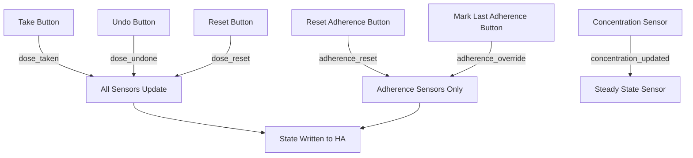

# Contribution guidelines

[](https://ko-fi.com/axildor)

> [← Back to main README](README.md)

Contributing to this project should be as easy and transparent as possible, whether it's:

- Reporting a bug
- Discussing the current state of the code
- Submitting a fix
- Proposing new features

## Github is used for everything

Github is used to host code, to track issues and feature requests, as well as accept pull requests.

Pull requests are the best way to propose changes to the codebase.

1. Fork the repo and create your branch from `main`.
2. If you've changed something, update the documentation.
3. Make sure your code lints (using `scripts/lint`).
4. Test you contribution.
5. Issue that pull request!

## Any contributions you make will be under the MIT Software License

In short, when you submit code changes, your submissions are understood to be under the same [MIT License](http://choosealicense.com/licenses/mit/) that covers the project. Feel free to contact the maintainers if that's a concern.

## Report bugs using Github's [issues](../../issues)

GitHub issues are used to track public bugs.
Report a bug by [opening a new issue](../../issues/new/choose); it's that easy!

## Write bug reports with detail, background, and sample code

**Great Bug Reports** tend to have:

- A quick summary and/or background
- Steps to reproduce
  - Be specific!
  - Give sample code if you can.
- What you expected would happen
- What actually happens
- Notes (possibly including why you think this might be happening, or stuff you tried that didn't work)

People *love* thorough bug reports. I'm not even kidding.

## Use a Consistent Coding Style

Use [black](https://github.com/ambv/black) to make sure the code follows the style.

## Test your code modification

This custom component is based on the [custom-component template](https://github.com/ludeeus/custom-component).

It comes with a development environment in a container, easy to launch
if you use Visual Studio Code. With this container you will have a stand alone
Home Assistant instance running and already configured with the included
[`configuration.yaml`](./config/configuration.yaml)
file.

## License

By contributing, you agree that your contributions will be licensed under its MIT License.

---

## Project Structure

```
custom_components/ax_dose_logger/
├── __init__.py          # Integration entrypoint, platform forwarding, reload handling
├── button.py            # Take, Reset, Undo, Reset Adherence %, Mark Last Adherence Taken, Skip Dose button entities
├── calendar.py          # Calendar entity for expected dose times
├── config_flow.py       # 4-step config wizard + 3-step options flow
├── const.py             # Domain, logger, effectiveness metrics, release types, PK defaults
├── data.py              # Type aliases (AxDoseLoggerConfigEntry, AxDoseLoggerData)
├── entity.py            # Base AxDoseLoggerEntity class
├── manifest.json        # HACS metadata (domain, version, codeowners)
├── number.py            # Inventory, refill, and effectiveness slider entities
├── sensor.py            # Sensor platform orchestrator (creates all sensor instances)
├── strings.json         # English UI strings for config/options flows
├── sensors/
│   ├── adherence.py     # Rolling adherence % (7/14/30/365 days)
│   ├── avg_doses.py     # Rolling daily averages (7/14/30/365 days)
│   ├── concentration.py # PK model (Bateman IR + hybrid ER 4-compartment)
│   ├── days_left.py     # Days-left / Est. days-left sensor (medicine, drink, master)
│   ├── drink_avg_doses.py   # Rolling daily averages for granular drinks
│   ├── drink_cooldown.py    # Drinks Available (cooldown) sensor
│   ├── drink_last_dose.py   # Last drink timestamp (granular)
│   ├── drink_master.py      # Master Tracker Amount in Body sensor
│   ├── drink_master_avg.py  # Master Tracker rolling daily averages
│   ├── drink_master_daily_amount.py  # Master Tracker Amount in Last 24h
│   ├── drink_master_last_dose.py     # Master Tracker last drink timestamp
│   ├── drink_master_sleep_disruption.py  # Sleep Disruption + Low sensors
│   ├── drink_total.py   # Lifetime drink counter (granular)
│   ├── last_dose.py     # Most recent dose timestamp
│   ├── next_dose.py     # Next scheduled dose + safe_to_take attribute
│   ├── pill_daily_amount.py  # Amount in Last 24h (medicine)
│   ├── pill_limit.py    # Sliding window pill limit counter
│   ├── steady_state.py  # Days to 90% steady state (with bioavailability scaling)
│   ├── strength.py      # Configured per-dose strength (mg)
│   └── total.py         # Lifetime dose counter
└── translations/
    └── en.json          # Runtime English localization (mirrors strings.json)
```

## Architecture Overview



All buttons fire dispatcher signals keyed by `entry_id`. Each sensor listens to the relevant signals and updates its state independently. The concentration sensor additionally broadcasts its current mass to the steady state sensor for real-time recalculation.

## Signal Reference

| Signal | Emitted By | Consumed By | Purpose |
|--------|-----------|-------------|---------|
| `pill_taken_{entry_id}` | Take Button | All sensors, inventory | Log a dose and trigger recalculation |
| `pill_reset_{entry_id}` | Reset Button | All sensors, inventory | Clear all history and reset counters |
| `pill_undone_{entry_id}` | Undo Button | All sensors, inventory | Revert the most recent dose |
| `pill_adherence_reset_{entry_id}` | Reset Adherence % Button | Adherence sensors only | Clear adherence timestamps without affecting PK or other sensors |
| `pill_adherence_override_{entry_id}` | Mark Last Adherence Taken Button | Adherence sensors only | Cover the most recent missed dose slot for adherence only |
| `ax_dose_logger_dose_skipped` (bus) | Skip Dose Button | Overdue + Next Dose sensors | Cover the current missed slot to clear overdue + advance next-dose; does NOT affect PK, inventory, totals, or adherence |
| `pill_add_stock_{entry_id}` | Refill Number | Inventory | Add a refill amount |
| `concentration_updated_{entry_id}` | Concentration Sensor | Steady State Sensor | Push live drug mass for steady-state recalculation |

## Config Flow Architecture

**Initial setup (4 steps):**
1. `user` → choose name + tracking type + release type
2. `regular_interval` / `time_of_day` / `as_needed` / `cyclic` → schedule & dosing parameters
3. `pk` → pharmacokinetic parameters (varies by release type)
4. `effectiveness` → metrics toggles + adherence settings

**Options flow (3 steps):**
1. `init` → schedule & dosing (varies by tracking type) + optional tracking-type change
2. `pk` → pharmacokinetic parameters (varies by release type)
3. `effectiveness` → metrics toggles + adherence settings

## Development Setup

1. Clone this repository into your Home Assistant `custom_components/` directory
2. Install the dev container: `.devcontainer/devcontainer.json` is provided
3. Run `scripts/setup` to install dependencies
4. Run `scripts/lint` to check code quality
5. Use `scripts/develop` to start a local Home Assistant instance with the integration loaded
