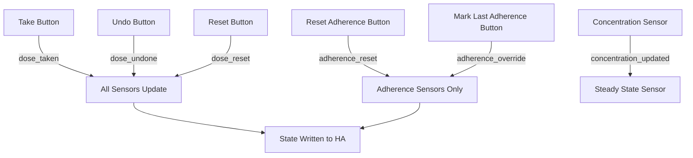

# 💊 AX Dose Logger

A fully local Home Assistant integration for tracking **medications and drinks** — when you took them, when your next dose is, and whether it's safe to take another. It runs entirely on your instance with no cloud dependency.

For **medications**, it models how much drug is in your body over time using pharmacokinetic engines for both instant-release and sustained-release formulations, tracks how well your meds are working with custom sliders, and sends mobile reminders when it's time to take a dose.

For **drinks** (caffeine & alcohol), it tracks each drink granularly (one device per drink) and aggregates the doses into global Master Trackers that draw decay curves using integration-level metabolic constants.

> ⚠️ **Medical disclaimer:** This integration is for informational and home automation purposes only. It is not a certified medical device. Always follow your doctor's advice and the instructions on your prescription.

[](https://ko-fi.com/axildor)

---

## 🃏 Companion Card

AX Dose Logger was built **in tandem** with the dedicated [**AX Dose Logger Card**](https://github.com/Axildor/AX-Dose-Logger-Card) — a Lovelace card that surfaces everything the integration produces with no template YAML and no Mushroom/Card-Mod dependencies. The two were programmed together and are designed to work as a pair.

That said, the integration is fully usable on its own. Every feature (sensors, buttons, services, events) is exposed through standard Home Assistant entities and is available to any dashboard, automation, or template you build yourself.

**Install the card:** `https://github.com/Axildor/AX-Dose-Logger-Card` → HACS → Custom Repositories → **Dashboard** category. See [Dashboard Card](#dashboard-card) below.

---

## Table of Contents

- [Companion Card](#-companion-card)
- [Key Features](#key-features)
- [Getting Started](#getting-started)
- [Medications](#medications)
  - [Tracking Modes](#tracking-modes)
  - [Staying Safe](#staying-safe)
  - [Pharmacokinetics Overview](#pharmacokinetics-overview)
  - [Tracking How Well It Works](#tracking-how-well-it-works)
  - [Adherence & Averages](#adherence--averages)
  - [Inventory & Undo](#inventory--undo)
- [Drinks (Caffeine & Alcohol)](#drinks-caffeine--alcohol)
  - [How Drinks Work](#how-drinks-work)
  - [Configuring a Drink](#configuring-a-drink)
  - [Drink Services & Events](#drink-services--events)
  - [Master Tracker Sensors](#master-tracker-sensors)
  - [Sleep Disruption Bands](#sleep-disruption-bands)
- [Dashboard Card](#dashboard-card)
- [Reminders](#reminders)
- [Building Automations](#building-automations)
- [Configuration Reference](#configuration-reference)
- [Pharmacokinetics Reference](#pharmacokinetics-reference)
- [Entity States & Attributes](#entity-states--attributes)
- [Contributing](#contributing)

---

## Key Features

**Medications**
- Four tracking modes: fixed interval, time of day, as-needed (PRN), and cyclic on/off patterns
- Rolling pill-limit window that prevents accidental overdose (each pill expires individually)
- Pharmacokinetic modeling of drug amount in your body — instant-release (Bateman) and sustained-release (4-compartment hybrid) engines
- Steady-state tracking for scheduled medications
- 24-hour intake window with optional daily dose limit
- Adherence percentages and rolling dose averages (7/14/30/365 days)
- Daily-locked 0–10 symptom sliders (Pain, Mood, Nausea, Fatigue + custom)
- Smart inventory with refill dialog and estimated days-left sensor
- Undo last dose (reverts every sensor + the PK model)
- Calendar entity for expected dose times
- Ready-made reminder blueprint with Take / Skip / Snooze actions

**Drinks (Caffeine & Alcohol)**
- One granular device per drink (e.g. "Morning Espresso", "Evening Beer")
- Global Master Trackers draw the decay curve for each substance (caffeine first-order, alcohol zero-order)
- Sleep Disruption sensor (None / Low / Moderate / High) — how much the current load disrupts sleep
- Predictive "Low" timestamp + hours-until countdown sensors
- Per-drink cooldown window with override always available
- 24-hour intake window with optional daily limit (FDA caffeine default 400 mg)
- Stock counter, add-stock input, and days-left estimation

---

## Getting Started

1. **Install the integration** — In HACS, go to ⋮ → Custom Repositories, paste this repository URL, choose **Integration** as the category, then download and restart Home Assistant.
2. **Add a medication or drink** — Head to Settings → Devices & Services → Add Integration and search for **AX Dose Logger**. The config flow walks you through it in four steps (medications) or three steps (drinks).

<!-- SCREENSHOT: The 4-step AX Dose Logger config flow — capture step 1 (name + tracking type + release type) or a composite of all 4 steps -->


3. **Add the card to your dashboard** — Install the dedicated [AX Dose Logger Card](https://github.com/Axildor/AX-Dose-Logger-Card) and add it via the visual editor. No template YAML required. *(Optional — the integration works on its own.)*

---

## Medications

### Tracking Modes

AX Dose Logger supports four ways to track a medication, depending on how you take it:

| Mode | When to Use It | What Happens |
|------|---------------|--------------|
| **Regular Interval** | You take it every N hours (e.g. every 8 hours) | Schedules doses at fixed intervals from midnight. Shows a countdown to your next dose. |
| **Time of Day** | You take it at the same time each day (e.g. 08:30 every morning) | One dose per day at the time you pick. The calendar entity shows daily events. |
| **As Needed (PRN)** | You take it when you need it, but there's a limit (e.g. max 2 in 8 hours) | No fixed schedule — you log doses as you take them. The pill limit enforces a rolling window. |
| **Cyclic / Calendar Pattern** | You take it on a cycle — some days on, some days off (e.g. 5 days on, 2 days off) | Doses only happen on ON days at the time you set. The calendar entity only shows events on ON days. |

### Staying Safe

Accidentally taking too much is easy to do, especially with medications that have a wide dosing window. AX Dose Logger helps prevent that:

- **Pill Limit Tracking** — You set how many pills are safe within a rolling time window (e.g. max 3 pills in 24 hours). Each pill expires from the window individually, so the limit recovers one at a time. On Cyclic OFF days, the limit drops to 0 automatically.
- **Overdose Warning** — When the pill limit hits 0, the Take button on the dedicated AX Dose Logger Card turns red and asks you to confirm before logging.

<!-- SCREENSHOT: Daily pane with pill limit at 0 — Take button red with the confirmation dialog visible -->


- **Next Dose Countdown** — The Next Dose sensor tells you exactly when your next scheduled dose is, so you can show live countdowns like "in 2 hours" or "Available now". For scheduled medications (Time of Day, Cyclic), the next dose always reflects your prescribed clock time — taking a dose late does not drift the schedule. The separate **Pills Safe to Take** sensor tells you whether it's actually safe to take now.

### Pharmacokinetics Overview

If you want to understand what's happening in your body between doses, AX Dose Logger can optionally model the **amount of medication in your system over time**. When enabled, it creates sensors based on your tracking type:

- **Amount in Body** — Current drug amount (mg), updated every 2 minutes, accounting for absorption and elimination. Available for all tracking types.
- **Amount in Last 24h** — Sliding 24-hour window showing the total dose strength consumed in the last 24 hours. This is **intake** (how much you swallowed), not body load. Set an optional **24h Dose Limit** and the `remaining` attribute exposes the headroom left — for automations and the card to warn before the next dose pushes you over a daily cap. Available for all tracking types.
- **Steady State** — Days remaining until you reach 90% steady state, with the theoretical maximum and your current percentage. **Scheduled medications only** (Regular Interval, Time of Day, Cyclic) — not available for As Needed, since steady state requires a fixed dosing interval.

You choose a **Release Type** when adding a medication:

- **Instant Release** — Three parameters: Dose Strength (mg), Elimination Half-Life (h), and Time to Peak Concentration (h; set to 0 for immediate-release). Uses a two-compartment (Bateman) model. An optional Lag Time (min) can model delayed-release formulations.
- **Sustained Release** — Adds Bioavailability (%), Initial Release (%), Sustained Release Duration (h), Release Half-Life (h), and Lag Time (min) to model hybrid extended-release formulations with both fast-acting and slow-release components.

Leave all PK values at 0 to disable concentration tracking. The Amount in Body sensor reports `0` when PK fields are not configured.

> **Note:** The sensor reports **drug amount in the body (mg)**, not blood concentration. Converting to concentration would require the volume of distribution, which varies from person to person.

[See the full pharmacokinetics reference ↓](#pharmacokinetics-reference) for formulas, worked examples, and scientific methodology. For help finding your medication's PK parameters, see the [PK Search Guide](#pk-search-guide).

### Tracking How Well It Works

Not sure if your medication is actually helping? AX Dose Logger can add 0–10 daily-locked sliders so you can rate how you feel each day:

- **Standard symptoms**: Pain, Mood, Nausea, Fatigue
- **Custom symptoms**: Add your own (e.g. "brain fog", "joint stiffness") — each one gets its own slider
- **Daily-locked**: Each slider can only be set once per calendar day. If you try to change it, you'll get a warning with an option to override. Sliders reset to **unknown** at midnight — unset days are not imputed to 0 or any default, following FDA Patient-Reported Outcome (PRO) guidance that missing data must remain missing.

### Adherence & Averages

AX Dose Logger gives you several ways to look at your dosing history:

- **Adherence Percentage** — Four rolling sensors (7, 14, 30, 365 days) showing what percentage of scheduled doses you took on time. A dose counts as "on time" if it falls within ±grace period of the expected slot. Cyclic mode only counts ON days. As Needed medications report `Unavailable` since adherence doesn't apply without a schedule.
- **Rolling Averages** — Day-level dose coverage over 7, 14, 30, and 365 days (the fraction of scheduled days in the window on which at least one dose was taken, 0.0–1.0). Windows are anchored to your first recorded dose, so setting up a medication before you start taking it doesn't penalize the averages. A late-but-taken dose does not lower the average. Cyclic mode only counts ON days. Timing quality (on-time vs late) is reported separately by the Adherence Percentage sensors.
- **Total Doses** — Cumulative lifetime dose counter.
- **Last Dose** — Timestamp of your most recent dose.
- **Days Since First Dose** — Integer days elapsed since your first recorded dose.

### Inventory & Undo

- **Smart Inventory** — Tracks how many pills you have left. Double-tap the inventory tile on the AX Dose Logger Card to open the refill dialog, enter the new box amount, and it automatically adds to your total.

<!-- SCREENSHOT: Double-tap on the inventory tile showing the refill input dialog -->


- **Days Left** — How many days your current inventory lasts. Scheduled medications divide Pills Left by the configured doses/day. As-Needed medications divide by the 7-day average doses/day (shows `unknown` until enough history exists).
- **Undo Last Dose** — Pressed Take by accident? The Undo button reverts the most recent dose across all sensors, counters, and the PK model — restoring inventory, removing the timestamp, and recalculating the concentration curve from dose history.

---

## Drinks (Caffeine & Alcohol)

In addition to medications, AX Dose Logger can track caffeinated and alcoholic drinks. The first config-flow step asks you to choose a **Device Category**:

- **Medication** — the legacy flow (scheduled pills, PK concentration, adherence, etc.)
- **Drink** — track a caffeine or alcohol drink with a granular device

A global **Drink Settings** entry holds the metabolic constants and the two Master Tracker devices. It is **auto-created the first time you add a drink** — never a manual choice. Edit its global constants later via the **Configure** button on the auto-created Drink Settings entry.

### How Drinks Work

Each configured drink becomes its own **Granular Drink Device** (e.g. "Morning Espresso", "Evening Beer") with a set of control and configuration entities:

| Entity | Type | Purpose |
|--------|------|---------|
| **Log Drink** | Button | Records a drink and forwards `dose_strength` + `drinking_duration` to the matching substance's Master Tracker. **Pressing this is what activates the Master Tracker PK engines.** |
| **Undo Drink** | Button | Reverts the last drink + its master contribution |
| **Reset History** | Button (config) | Clears the drink's local history + master contribution |
| **Inventory** | Number | Counts down by 1 per Log Drink press (using your configured unit, e.g. Cups/Cans/Bottles) |
| **Add Stock** | Number | Disposable input to refill the Inventory counter |
| **Total** | Sensor | Cumulative drink count |
| **Last Drink** | Sensor (timestamp) | Most recent drink timestamp |
| **Daily Average** | Sensors | 7/14/30/365-day daily-average sensors |
| **Drinks Available** | Sensor | Cooldown state (when a cooldown window is configured) |
| **Est. Days Left** | Sensor | Days inventory lasts at the current rate |

The Lovelace card's **Log Drink popup** shows a predictive **"Low: hh:mm"** line under each drink name — the wall-clock time the body-mass is expected to drop into the *Low* sleep band *if that drink were logged now*. "Low: —" means the drink would not lift body-mass above the Low band (a safe drink). The prediction is fetched live from the backend and never mutates real state.

#### Cooldown (Drinks Available Sensor)

When a drink has a `cooldown_window > 0`, a **Drinks Available** sensor (`sensor.<drink>_drinks_available`) is created on the granular drink device, mirroring the medicine **Pills Safe To Take** sensor's contract so the Lovelace card consumes it identically:

| State | Meaning |
| --- | --- |
| `1` | A drink is available (outside the cooldown window, or no history yet) |
| `0` | Cooldown active — limit reached for this window |

| Attribute | Type | Description |
| --- | --- | --- |
| `cooldown_ends_at` | datetime (ISO) \| null | When the current cooldown window expires. The card renders the "Next XXm" countdown from this. |
| `last_dose_time` | datetime (ISO) \| null | Timestamp of the most recent drink. The card renders the "Last XXm" display from this. |
| `cooldown_window_hours` | float | The configured cooldown window in hours. |
| `within_cooldown` | bool | Raw boolean mirror of the coordinator's lockout check, for templates that prefer a boolean. |

> **Override always available.** The cooldown is a *soft* warning, never a hard backend block. The **Log Drink** button and the `ax_dose_logger.log_drink` service always record the drink, so a user can override the lockout directly from the HA UI or an automation at any time. The card soft-disables the button and shows a "Last XXm * Next XXm" countdown when `native_value == 0`, with an explicit override affordance.

### Configuring a Drink

1. **Add a Device** → choose **Drink** as the category.
2. **Drink Setup** — name, drink type (Caffeine/Alcohol), unit of measurement (e.g. Cups, Cans, Bottles), and an initial stock count.
3. **Cooldown Timer** — optional lockout window in hours (0 = disabled; minimum is always 1). See the cooldown note above.
4. **Drink Details** —
   - Caffeine: `caffeine_mg` + `drinking_duration` (typical time to finish, minutes).
   - Alcohol: `volume_ml` + `abv_percent` + `drinking_duration`. The ethanol mass is calculated automatically: `grams = volume_ml × (abv_percent / 100) × 0.789` (Widmark formula). `bioavailability` is hardcoded to 100 for all drinks.

Edit the global metabolic constants via **Configure** on the Drink Settings entry:

| Constant | Default | Unit |
|----------|---------|------|
| Caffeine Half-Life | 5.0 | hours |
| Caffeine Time to Peak | 0.75 | hours |
| Alcohol Elimination Rate | 8.0 | g/h |

### Drink Services & Events

In addition to the **Log Drink** button, three services are available for automations:

- `ax_dose_logger.log_drink` — log a drink (entry_id + optional timestamp)
- `ax_dose_logger.undo_drink` — revert the last drink + its master contribution
- `ax_dose_logger.reset_drink` — clear a drink's local history + master contribution

The `ax_dose_logger_drink_taken` bus event fires on every log with `{entry_id, drink_type, dose_strength, drink_name}` for automations (e.g. "if caffeine in body > 200mg, dim lights").

> **Note:** Master Tracker devices expose a `drink_master: true` + `substance` attribute so the AX Dose Logger Card can identify them and render the dedicated Drinks card. Granular drink devices expose a `device_type: "drink"` + `substance` attribute so the card can group drinks by substance.

### Master Tracker Sensors

When you press **Log Drink**, the dose is forwarded to the matching **Master Tracker** virtual device, which draws the global decay curve. There are two Master Trackers:

| Master Tracker | Substance | PK Model | Amount in Body sensor |
|----------------|-----------|----------|-----------------------|
| **Caffeine Tracker** | Caffeine (mg) | Discretized uniform-absorption: each drink is split into mini-boluses spread across its `drinking_duration`, each absorbed via the IR Bateman equation with the global half-life and tmax. Linear PK → exact superposition across all caffeine drinks. | `sensor.total_caffeine_in_body` (displayed as **Amount in Body**) |
| **Alcohol Tracker** | Alcohol (g ethanol) | Zero-order (Michaelis-Menten saturated) elimination at a configurable grams-per-hour rate. Doses add instantly; elimination advances on every tick. | `sensor.total_alcohol_in_body` (displayed as **Amount in Body**) |

> Entity IDs `sensor.total_caffeine_in_body` / `sensor.total_alcohol_in_body` are preserved for backward compatibility.

Each Master Tracker hosts the following sensors:

| Sensor | Entity ID | What It Shows |
|--------|-----------|---------------|
| **Amount in Body** | `sensor.total_<substance>_in_body` | Current body-mass (mg caffeine / g alcohol), updated every 1-min decay tick. |
| **Sleep Disruption** | `sensor.sleep_disruption` | Categorical readout (`None` / `Low` / `Moderate` / `High`) — see [bands below](#sleep-disruption-bands). Recomputed on every coordinator push. |
| **Low - Timestamp** | `sensor.estimated_low_time` | Wall-clock time the body-mass will decay into the *Low* band. Displayed as `HH:MM` (24-hour) by the card; HA's more-info still shows the full datetime (keeps `TIMESTAMP` device class). `None` once already in the Low band or below. |
| **Low - Hours Until** | `sensor.low_hours_until` | Numeric `DURATION` (hours) countdown to the same Low-band milestone. `None` once already in Low or below. |
| **Amount in Last 24h** | `sensor.amount_in_last_24h` | Sliding 24-hour window — total strength of that substance consumed in the past 24 hours (mg caffeine / g alcohol). Aggregates **every** logged drink of that substance. |
| **Last Drink** | `sensor.<substance>_last_drink` | Timestamp of the most recent drink of that substance across all granular drink devices. |
| **Daily Average** | rolling avg sensors | 7/14/30/365-day daily-average sensors aggregating every drink of that substance. |

> **No "Days Left" sensor on the Master Tracker.** The aggregate device has no single inventory of its own, so a days-left reading would be misleading. Each granular drink device has its own **Est. Days Left** sensor (see the Drinks section), and the Inventory panel surfaces it per drink.

**Low - Timestamp** carries `estimated_none_time` (the sleep-safe moment when body-mass enters the None band) as an attribute. **Low - Hours Until** carries `estimated_none_hours` (the longer-horizon countdown to the sleep-safe None band) + `low_threshold` + `low_threshold_unit` as attributes. Both become `None` once the body-mass is in the None band.

**Decay formulas** (stated once, used by both Low sensors and the Sleep Disruption `minutes_until_next_band` attribute):
- **Caffeine** (first-order): `t = ln(M / threshold) ÷ ke`, where `ke = ln(2) / half_life`.
- **Alcohol** (zero-order linear): `t = (M − threshold) ÷ rate`.

The Sleep Disruption sensor's extra attributes expose the raw `body_mass` + unit, the `next_band` it will drop into, and `minutes_until_next_band` (estimated decay time to the next-lower band).

#### Amount in Last 24h — Daily Limits

Per-substance daily limits are configurable in **Drink Settings** (Configure):

| Substance | Unit | Default Limit | Source |
| --- | --- | --- | --- |
| **Caffeine** | mg | **400 mg** (FDA — healthy adults) | User-overridable. Lower for lighter body mass, pregnancy, or caffeine sensitivity. `0` = no limit. |
| **Alcohol** | g ethanol | **0 g** (no FDA limit) | User-overridable in grams ethanol. US Dietary Guidelines ≈ 14 g/day women, 28 g/day men (1 standard drink ≈ 14 g). `0` = no limit. |

When a limit is set (> 0), the sensor exposes a `remaining` attribute (`daily_limit - amount`) so automations and the card can warn "X mg of 400 mg — Y left" before the next drink pushes intake over the cap.

> **Intake vs. body load:** *Amount in Last 24h* tracks **how much you swallowed** in the rolling window — the correct value for comparing against FDA/Dietary Guidelines daily limits (which are stated as total daily *intake*, not plasma concentration). For the **current active amount in your body** (accounting for absorption and elimination), use the Master Tracker's *Amount in Body* sensor instead. These answer different questions: a dose taken 20 hours ago has mostly cleared from your body but still counts toward your 24h intake budget.

### Sleep Disruption Bands

The Sleep Disruption sensor classifies the current body-mass load into a categorical band indicating how much it is likely to disrupt sleep. The state is a bare label (no unit suffix); the threshold ranges are documented below. The band is recomputed on every coordinator push (dose event or 1-min decay tick) so it tracks clearance in real time.

#### Caffeine — Sleep Disruption Bands

| State | Threshold | Biological Impact at Bedtime |
| --- | --- | --- |
| **None** | `0 - 10 mg` | **Negligible impact.** The liver has effectively cleared the drug. Adenosine receptor binding is minimal. Normal sleep architecture and natural melatonin production occur. |
| **Low** | `11 - 30 mg` | **Minor architectural shift.** Roughly equivalent to the residual trace of a cup of green tea. Sleep latency is unaffected, and deep sleep metrics on wearables remain largely stable. Minor delays in the first REM cycle may occur. |
| **Moderate** | `31 - 60 mg` | **Hidden disruption.** Roughly equivalent to a residual espresso shot. Users will likely still fall asleep easily, but Slow-Wave Sleep is measurably suppressed. Expect reduced deep sleep duration and an elevated resting heart rate during the first half of the night. |
| **High** | `61+ mg` | **Severe disruption.** Heavy adenosine A2A receptor blockade. Increases sleep latency (tossing and turning), multiplies unconscious micro-arousals, and chemically delays the circadian melatonin trigger. |

> **Note on "Immunity":** If you drink coffee late in the day and feel "immune" to it because you still get 8 hours of sleep, your central nervous system is still being robbed of its primary phase for physical and cognitive regeneration. You are unconscious, but you are not getting deep sleep.

#### Alcohol — Sleep Disruption Bands

| State | Threshold | Biological Impact at Bedtime |
| --- | --- | --- |
| **None** | `0 g` | **Clean architecture.** The liver has cleared all ethanol. Normal sleep cycling, baseline resting heart rate, and natural REM duration occur. |
| **Low** | `1 - 10 g` | **Minor rebound.** (Less than 1 standard drink remaining). The ethanol will clear within the first 1-2 hours of sleep. Minor suppression of the first REM cycle, with a slight, brief elevation in resting heart rate. |
| **Moderate** | `11 - 30 g` | **Moderate architectural stress.** (Roughly 1 to 2.5 standard drinks remaining). Noticeable REM suppression. The glutamate rebound will occur during the middle of the night, causing restless sleep, potential temperature dysregulation (sweating), and a measurable drop in Heart Rate Variability (HRV) on fitness trackers. |
| **High** | `31+ g` | **Severe disruption.** Heavy REM suppression. The body is dedicating massive metabolic resources to clearance. Expect frequent mid-night awakenings, a spiked resting heart rate that stays elevated for hours, diuretic effects (waking up for the bathroom), and severe REM rebound (vivid, stressful dreams) if sleep is extended. |

> **Note on "The Nightcap":** Using alcohol to fall asleep faster is a biological trap. You are trading sleep latency (falling asleep quickly) for sleep architecture (restorative sleep). Wearable data will almost always show a destroyed Heart Rate Variability (HRV) and elevated resting heart rate for hours after a late-night drink, leaving you physically exhausted the next day regardless of hours spent in bed.

---

## Dashboard Card

AX Dose Logger has a dedicated Lovelace card that surfaces everything the integration produces — no template YAML, no Mushroom/Card-Mod dependencies. It's a separate repository, installed via HACS as a **Dashboard** card.

**Install:** `https://github.com/Axildor/AX-Dose-Logger-Card` (HACS → Custom Repositories → Dashboard category)

Once installed, add it to your dashboard via the visual editor and pick your medication or drink device from the dropdown. The card has four panes, selectable via tabs at the bottom:

| Pane | What It Shows |
|------|---------------|
| **📅 Daily** | Take Pill / Log Drink button with next-dose countdown, pills/drinks safe indicator, last dose timestamp, inventory count (double-tap to refill), custom chips for any related entities |
| **📊 Graphs** | Bar graph of daily doses with selectable timescales (14D, 30D, 60D) + amount-in-body line graph with selectable timeframes (12H, 48H, 7D, 14D, 30D) |
| **📈 Stats** | Rolling averages (7/14/30/365 days), adherence percentages (7/14/30/365 days), total doses, days since first dose |
| **🔧 Tools** | Reset adherence percentage, Mark last missed dose as taken, Reset dose history, Undo last dose |

**Daily pane** — medication name, Take Pill button with next-dose countdown, pills safe to take, last dose, inventory count, custom chips:

<!-- SCREENSHOT: Card showing the Daily pane — medication name, Take Pill button with next-dose countdown, pills safe to take, last dose, inventory count, custom chips -->


**Graphs pane** — daily-dose bar graph with timescale selector + amount-in-body line graph with timeframe selector:

<!-- SCREENSHOT: Card showing the Graphs pane — daily-dose bar graph with timescale selector + amount-in-body line graph with timeframe selector -->


**Stats pane** — rolling average boxes (7/14/30/365 days), adherence percentage boxes, total doses, days since first dose:

<!-- SCREENSHOT: Card showing the Stats pane — rolling average boxes (7/14/30/365 days), adherence percentage boxes, total doses, days since first dose -->


**Tools pane** — Reset Adherence %, Mark Last Adherence Taken, Reset History, Undo Last Dose buttons:

<!-- SCREENSHOT: Card showing the Tools pane — Reset Adherence %, Mark Last Adherence Taken, Reset History, Undo Last Dose buttons -->


For full card configuration options (color schemes, column layouts, chip customization, graph toggles), see the [AX Dose Logger Card repository](https://github.com/Axildor/AX-Dose-Logger-Card#readme).

---

## Reminders

There's a ready-made Blueprint you can import for push notifications with Take, Skip, and Snooze actions:

1. Go to Settings → Automations → Blueprints → Import Blueprint
2. Paste: `https://raw.githubusercontent.com/Axildor/AX-Dose-Logger/main/blueprints/reminder.yaml`
3. Create a new automation from the blueprint, pick your phone, and map your AX Dose Logger entities.

> **Safety guard**: The blueprint has an optional "Pills Safe to Take Sensor" input. When mapped, the notification's **Taken** action will not auto-log a dose if you're at the pill limit — instead it sends a warning telling you to open the AX Dose Logger card to override. This keeps the notification from bypassing the rolling-window overdose protection.

---

## Building Automations

Each medication and drink shows up as a **Device** in Home Assistant. Replace `ibuprofen` with your entity name in the examples below.

### Sensors

| Sensor | Entity ID | What It Shows | Key Attributes |
|--------|-----------|---------------|----------------|
| Total Doses | `sensor.ibuprofen_total_doses` | Cumulative lifetime dose count | — |
| Days Since First Dose | `sensor.ibuprofen_days_since_first_dose` | Integer days elapsed since the first recorded dose | `first_dose_timestamp`, `history_start_date` |
| Last Dose | `sensor.ibuprofen_last_dose` | Timestamp of most recent dose | — |
| Pills Safe to Take | `sensor.ibuprofen_pills_safe_to_take` | Remaining pills safe to take in the current window | `timestamps`, `time_window_hours`, `in_on_window` (Cyclic only), `window_expires_at` (when the limit resets; `null` if not at the limit) |
| Amount in Body | `sensor.ibuprofen_amount_in_body` | Current drug amount in body (mg) — requires PK fields | `last_updated`, `gut_mass`, `ka`, `lag_time`, `dose_history` (IR); `gut_ir_mass`, `matrix_sr_mass`, `gut_sr_mass`, `ka`, `kr`, `lag_time`, `dose_history` (ER) |
| Amount in Last 24h | `sensor.ibuprofen_amount_in_last_24h` | Total dose strength consumed in the last 24 hours (mg/μg/g) | `window_hours`, `doses_in_window`, `daily_limit` (`null` when 0), `remaining` (`null` when no limit), `unit_of_measurement` |
| Next Dose | `sensor.ibuprofen_next_dose` | Timestamp of next scheduled dose | `safe_to_take` (number of pills safe to take remaining now) |
| 7-Day Average | `sensor.ibuprofen_avg_daily_doses_7_days` | Day-level dose coverage over 7 days (0.0–1.0) | `covered_days`, `scheduled_days`, `effective_window_days` |
| 14-Day Average | `sensor.ibuprofen_avg_daily_doses_14_days` | Day-level dose coverage over 14 days (0.0–1.0) | `covered_days`, `scheduled_days`, `effective_window_days` |
| 30-Day Average | `sensor.ibuprofen_avg_daily_doses_30_days` | Day-level dose coverage over 30 days (0.0–1.0) | `covered_days`, `scheduled_days`, `effective_window_days` |
| Yearly Average | `sensor.ibuprofen_avg_daily_doses_yearly` | Day-level dose coverage over 365 days (0.0–1.0) | `covered_days`, `scheduled_days`, `effective_window_days` |
| 7-Day Adherence | `sensor.ibuprofen_adherence_7_days` | Adherence % over 7 days | `actual_doses`, `expected_doses`, `grace_hours` |
| 14-Day Adherence | `sensor.ibuprofen_adherence_14_days` | Adherence % over 14 days | `actual_doses`, `expected_doses`, `grace_hours` |
| 30-Day Adherence | `sensor.ibuprofen_adherence_30_days` | Adherence % over 30 days | `actual_doses`, `expected_doses`, `grace_hours` |
| 365-Day Adherence | `sensor.ibuprofen_adherence_365_days` | Adherence % over 365 days | `actual_doses`, `expected_doses`, `grace_hours` |
| Steady State | `sensor.ibuprofen_days_to_steady_state` | Days remaining to 90% steady state — scheduled medications only, requires PK fields | `theoretical_max_mg`, `current_percentage`, `last_dose_timestamp` |
| Strength | `sensor.ibuprofen_strength` | Configured per-dose strength (mg) | — |
| Days Left | `sensor.ibuprofen_days_left` (scheduled) or `sensor.ibuprofen_days_left_est` (As Needed) | How many days the current inventory lasts | `stock`, `doses_per_day`, `estimation`, `window_days` |

> **PK fields note:** The Amount in Body sensor only produces meaningful values when **Dose Strength** and **Elimination Half-Life** are configured (non-zero). The Steady State sensor additionally requires a fixed dosing interval — it is only created for scheduled medications (Regular Interval, Time of Day, Cyclic), not As Needed.

### Buttons

| Button | Entity ID | What It Does |
|--------|-----------|-------------|
| Take | `button.ibuprofen_take` | Log a dose |
| Reset History | `button.ibuprofen_reset_history` | Wipe dose history (keeps inventory) |
| Undo Dose | `button.ibuprofen_undo_dose` | Revert the most recent dose across all sensors and PK model |
| Reset Adherence % | `button.ibuprofen_reset_adherence` | Clear adherence percentage history only — does NOT affect Amount in Body, dose count, or any other sensor |
| Mark Last Adherence Taken | `button.ibuprofen_cover_last_missed` | Mark the most recent missed dose slot as taken for adherence calculation only — does NOT add a dose to the PK model or dose count |

### Numbers

| Number | Entity ID | Range | What It Does |
|--------|-----------|-------|-------------|
| Pills Left | `number.ibuprofen_pills_left` | 0–9999 | Current inventory count |
| Add Refill | `number.ibuprofen_add_refill` | 0–∞ | Refill input (auto-resets to 0 after adding) |
| Effectiveness | `number.ibuprofen_{metric}_effectiveness` | 0–10 | Daily-locked per-metric rating slider (unknown until set, resets at midnight) |

### Calendar

| Calendar | Entity ID | What It Shows |
|----------|-----------|---------------|
| Dose Calendar | `calendar.ibuprofen_calendar` | Expected dose times on the HA calendar (optional, enabled by default) |

### Events

AX Dose Logger fires events on the Home Assistant event bus that you can use in automations:

| Event | When It Fires | Event Data |
|-------|--------------|------------|
| `ax_dose_logger_dose_taken` | Any Take button is pressed | `medication_name`, `timestamp` |
| `ax_dose_logger_dose_undone` | Any Undo button is pressed | `medication_name` |
| `ax_dose_logger_adherence_override` | Mark Last Adherence Taken button is pressed | `entity_id` |
| `ax_dose_logger_drink_taken` | Any Log Drink button is pressed | `entry_id`, `drink_type`, `dose_strength`, `drink_name` |

### Automation Examples

**Trigger when a dose is taken:**
```yaml
automation:
  - trigger:
      - platform: event
        event_type: ax_dose_logger_dose_taken
        event_data:
          medication_name: Ibuprofen
    action:
      - service: notify.mobile_app_your_phone
        data:
          message: "Ibuprofen dose logged at {{ trigger.event.data.timestamp }}"
```

**Alert when pill limit reaches 0:**
```yaml
automation:
  - trigger:
      - platform: numeric_state
        entity_id: sensor.ibuprofen_pills_safe_to_take
        below: 1
    action:
      - service: notify.mobile_app_your_phone
        data:
          message: "⚠️ No pills safe to take for Ibuprofen"
```

**Notify when steady state is reached** (scheduled medications only):
```yaml
automation:
  - trigger:
      - platform: numeric-state
        entity_id: sensor.ibuprofen_days_to_steady_state
        below: 0.1
    action:
      - service: notify.mobile_app_your_phone
        data:
          message: "✅ Ibuprofen has reached steady state"
```

---

## Configuration Reference

### Step 1: Add a Medication

| Field | Type | Description | Default |
|-------|------|-------------|---------|
| Medication Name | Text | Display name for the device | My Medication |
| Tracking Type | Dropdown | Choose a tracking mode (descriptions shown inline) | Regular Interval |
| Release Type | Dropdown | **Instant Release** for standard pills, **Sustained Release** for extended-release formulations | Instant Release |

> The medication name, tracking type, and release type can't be changed after creation. To switch, remove the entry and create a new one. *(The tracking type can be changed later via Configure — see [Reconfiguring](#reconfiguring-after-setup).)*

### Step 2: Schedule & Dosing

#### Regular Interval

| Field | Range | Description | Default |
|-------|-------|-------------|---------|
| Inventory | 0–9999 pills | Number of pills currently available | 30 |
| Dose Interval | 1–48 h | Minimum hours between consecutive doses | 8 |
| Pill Limit | 1–20 pills | Maximum pills you can take within the time window | 1 |
| Time Window | 0.5–168 h | Rolling window for the pill limit | 8 |
| Calendar Entity | Toggle | Show expected dose times on the HA calendar | On |

#### Time of Day

| Field | Range | Description | Default |
|-------|-------|-------------|---------|
| Inventory | 0–9999 pills | Number of pills currently available | 30 |
| Dose Time | Time picker | Time of day to take the medication | 08:00 |
| Pill Limit | 1–20 pills | Maximum pills you can take within the time window | 1 |
| Time Window | 0.5–168 h | Rolling window for the pill limit | 24 |
| Calendar Entity | Toggle | Show expected dose times on the HA calendar | On |

#### As Needed (PRN)

| Field | Range | Description | Default |
|-------|-------|-------------|---------|
| Inventory | 0–9999 pills | Number of pills currently available | 30 |
| Pill Limit | 1–20 pills | Maximum pills you can take within the time window | 2 |
| Time Window | 0.5–168 h | Rolling window for the pill limit | 8 |
| Calendar Entity | Toggle | Show expected dose times on the HA calendar | On |

#### Cyclic / Calendar Pattern

| Field | Range | Description | Default |
|-------|-------|-------------|---------|
| Inventory | 0–9999 pills | Number of pills currently available | 30 |
| Days On | 1–30 days | Number of active days in the cycle | 5 |
| Days Off | 1–30 days | Number of rest days in the cycle | 2 |
| Cycle Start Date | Date picker | Start date of the on/off cycle | Today |
| Dose Time | Time picker | Time of day to take on active days | 08:00 |
| Pill Limit | 1–20 pills | Maximum pills you can take within the time window | 1 |
| Time Window | 0.5–168 h | Rolling window for the pill limit | 24 |
| Calendar Entity | Toggle | Show expected dose times on the HA calendar | On |

### Step 3: Pharmacokinetics

> ⚠️ **Important:** PK parameters should be sourced from official pharmacokinetic data (e.g., FDA labels, EMA assessments, peer-reviewed literature). Do not guess — incorrect values will produce misleading results. See the [PK Search Guide](#pk-search-guide) for help.

**Common fields (all release types):**

| Field | Range | Description | Default |
|-------|------|-------------|---------|
| Dose Strength | 0–9999 mg | Amount of medication per dose. Set to 0 if not tracking concentration. | 0 |
| Elimination Half-Life | 0–168 h | Time for the body to eliminate half the drug. Set to 0 if not tracking concentration. | 0 |
| Time to Peak Concentration | 0–72 h | Hours after taking until concentration peaks. Set to 0 for immediate-release medications. | 0 |
| Bioavailability | 0–100 % | Fraction of the dose that reaches systemic circulation. For example, ibuprofen ≈ 87%, while some drugs are closer to 50%. | 100 |
| Lag Time | 0–1440 min | Minutes before the medication begins releasing. Leave at 0 if unsure — most drugs start releasing immediately. Typical values: 15–30 min for enteric-coated tablets, 60+ min for colon-targeted delivery. | 0 |
| 24h Dose Limit | 0–∞ (medication unit) | Optional daily intake cap. `0` = no limit. When set, the Amount in Last 24h sensor exposes a `remaining` attribute. | 0 |

**Sustained Release fields** (only shown when Release Type is Sustained Release):

| Field | Range | Description | Default |
|-------|------|-------------|---------|
| Initial Release | 0–100 % | Percentage of the dose released immediately (IR fraction). For Paracetamol (Panadol/Tylenol) ER 665 mg, this is 31%. | 100 |
| Sustained Release Duration | 0–72 h | Duration of the zero-order (constant-rate) release phase. Leave at 0 for matrix tablets (e.g. Paracetamol ER) — they are polymer sponges, not mechanical pumps. | 0 |
| Release Half-Life | 0–168 h | Half-life of the first-order release from the SR matrix (the polymer sponge's physical dissolution time). For Paracetamol (Panadol/Tylenol) ER 665 mg, this is 3.0 h. | 0 |

> Leave Dose Strength and Elimination Half-Life at 0 to disable concentration tracking. The Amount in Body sensor reports `0` when PK fields are not configured. The Steady State sensor is only created for scheduled medications.

### Step 4: Symptom & Adherence Tracking

| Field | Type | Description | Default |
|-------|------|-------------|---------|
| Tracked Symptoms | Multi-select | Check which symptoms to track (Pain, Mood, Nausea, Fatigue). Each gets a daily-locked 0–10 slider. | None |
| Custom Symptoms | Text | Separate multiple with commas (e.g. brain fog, joint stiffness). A daily-locked 0–10 slider is created for each. | — |
| Track Dose Adherence | Toggle | Show how consistently you take doses on time. Creates 7, 14, 30, and 365-day adherence sensors. | On (Off for As Needed) |
| On-Time Window | 0.5–24 h | How early or late a dose can be and still count as on-time. For example, 1 hour means ±1 hour around the scheduled time. | 1 |

### Reconfiguring After Setup

Click **Configure** on the integration entry to change settings without recreating the medication. The reconfiguration flow has 3 steps:

**Step 1: Schedule & Dosing** — A **Tracking Type** dropdown at the top lets you change how the medication is scheduled (e.g. from Regular Interval to Cyclic, or to As Needed). If you change it, an extra **New Schedule** step appears to collect the new type's schedule fields. If you keep the same type, the current schedule fields are shown inline. Dose history and effectiveness logs are preserved across the change.

**Step 2: Pharmacokinetics** (same as Step 3 above)

**Step 3: Symptom & Adherence Tracking** (same as Step 4 above)

> **Note:** The medication name and release type can't be changed after creation. The tracking type *can* be changed from the Configure dialog.

> **Changes apply automatically.** After saving, schedule, dosing, and PK changes propagate to all sensors within about a minute, or instantly when you log your next dose. No device reload is needed. The exceptions are: enabling/disabling the Calendar, Adherence, or tracked symptoms (which add or remove entities), and **changing the Tracking Type** (which reloads the device to recreate its sensors). In all cases your dose history and effectiveness logs are preserved.

---

## Pharmacokinetics Reference

This section covers the complete mathematical methodology behind AX Dose Logger's pharmacokinetic models. All calculations are transparent and evidence-based, using standard compartmental frameworks from clinical pharmacokinetics.

### Instant Release: The Two-Compartment Model

When you take a standard (instant-release) pill, the drug doesn't instantly appear in your bloodstream. It must first be absorbed from the gastrointestinal tract. AX Dose Logger models this as two compartments:

```
┌─────────┐    absorption (kₐ)    ┌─────────┐    elimination (kₑ)    ┌─────┐
│   Gut   │ ───────────────────▶ │  Body   │ ──────────────────────▶ │ Out │
│  (mg)   │                       │  (mg)   │                         │     │
└─────────┘                       └─────────┘                         └─────┘
```

- **Gut compartment**: Drug waiting to be absorbed. Decays exponentially as drug moves into the body.
- **Body compartment**: Drug currently in your system. Increases from absorption, decreases from elimination.

#### IR Parameters

| Parameter | What It Means | Example |
|-----------|--------------|---------|
| **Dose Strength (D)** | Milligrams per pill | 200 mg |
| **Elimination Half-Life (t½)** | Time for the body to eliminate half the drug | 2 hours |
| **Time to Peak Concentration (t_max)** | Hours after taking until the drug amount in the body is highest | 1.5 hours |
| **Bioavailability (F)** | Fraction of the dose that reaches systemic circulation | 87% |
| **Lag Time** | Minutes before the medication begins releasing. During the lag time, the entire dose sits inert (no absorption, no release). After the lag time elapses, normal release kinetics apply. Set to 0 for immediate onset. | 0 min (most drugs) |

#### How the Absorption Rate Is Calculated

The elimination rate constant is derived directly from the half-life:

> **kₑ = ln(2) / t½**

The absorption rate constant **kₐ** cannot be solved in closed form from t_max. Instead, it's found numerically using the standard pharmacokinetic relationship (Rowland & Tozer, 2011):

> **t_max = ln(kₐ / kₑ) / (kₐ − kₑ)**

AX Dose Logger solves this equation using a binary search over kₐ ∈ [0.0001, 20.0] with 50 iterations, which converges to within 0.001% accuracy.

#### The Bateman Equation

For a single dose of strength **D** at time t = 0, the amount of drug in the body at time **t** is given by the **Bateman equation**:

**General case (kₐ ≠ kₑ):**

> C(t) = F × D × kₐ / (kₐ − kₑ) × (e^(−kₑ·t) − e^(−kₐ·t))

**Limiting case (kₐ ≈ kₑ):**

> C(t) = F × D × kₐ × t × e^(−kₐ·t)

The gut compartment decays independently:

> G(t) = D × e^(−kₐ·t)

When a dose is taken while drug from a previous dose is still in the gut, the body compartment receives an additional contribution from the remaining gut mass:

> Body contribution from gut = F × G₀ × kₐ / (kₐ − kₑ) × (e^(−kₑ·t) − e^(−kₐ·t))

#### Immediate Release Mode

When **t_max = 0**, the dose enters the body directly with no absorption phase. This is appropriate for sublingual, IV, or fast-dissolving formulations. The formula simplifies to:

> C(t) = F × D × e^(−kₑ·t)

The gut compartment is bypassed entirely (G = 0 at all times).

### Sustained Release: The Four-Compartment Hybrid Model

For extended-release medications (e.g., Paracetamol (Panadol/Tylenol) ER 665 mg), the drug is released in two phases: an initial burst for quick onset, followed by a sustained release that maintains therapeutic levels. AX Dose Logger models this with four compartments:

```
                    ┌──────────────┐
                    │  IR Gut      │  Immediate-release fraction (F × D × IR%)
                    │  absorbs via kₐ│
                    └──────┬───────┘
                           │  kₐ absorption
                           ▼
┌──────────────┐    ┌──────────────┐    elimination (kₑ)    ┌─────┐
│  SR Matrix   │───▶│  SR Gut      │──────────────────────▶ │ Out │
│  (mg)        │    │  (mg)        │                         │     │
└──────────────┘    └──────┬───────┘                         └─────┘
  zero-order R₀             │  kₐ absorption
  then first-order kᵣ       ▼
                    ┌──────────────┐
                    │  Body        │
                    │  (mg)        │
                    └──────────────┘
```

- **IR Gut**: The immediate-release fraction of the dose, absorbed with rate constant kₐ (same as instant release).
- **SR Matrix**: The sustained-release fraction, released at a constant rate R₀ during the zero-order phase, then exponentially with rate constant kᵣ = ln(2) / release_half_life.
- **SR Gut**: Drug released from the SR matrix, waiting to be absorbed into the body with rate constant kₐ.
- **Body**: Drug currently in your system. Receives contributions from both IR and SR gut compartments, and is eliminated with rate constant kₑ.

#### SR Parameters

| Parameter | What It Means | Example (Paracetamol ER) |
|-----------|--------------|--------------------------|
| **Dose Strength (D)** | Milligrams per pill | 665 mg |
| **Elimination Half-Life (t½)** | Time for the liver to clear half the drug | 2.0 h |
| **Time to Peak Concentration (t_max)** | Hours until the overall formulation peaks | 2.8 h |
| **Immediate Release Time to Peak (IR t_max)** | Hours until the fast instant-release layer peaks | 1.0 h |
| **Bioavailability (F)** | Fraction reaching systemic circulation | 85% |
| **Initial Release (IR%)** | Percentage of the dose released immediately | 31% |
| **Sustained Release Duration (T_dur)** | Duration of the constant-rate (zero-order) release phase — 0 for matrix tablets | 0 h |
| **Release Half-Life** | Time for the polymer matrix sponge to physically dissolve | 3.0 h |

#### Piecewise Analytical Solution

The ER model uses exact analytical solutions for recalculation (on pill taken/undo/reset) and Euler integration for real-time decay updates.

**Phase 1: During zero-order release (0 ≤ t ≤ T)**

The SR matrix releases drug at a constant rate R₀ = (1 − IR%) × D × F / (T + release_half_life × (1 − e^(−kᵣ·T)) / (kᵣ × T)), ensuring the total SR fraction is fully released over the combined zero-order and first-order phases.

During this phase:
- IR gut: G_IR(t) = D_IR × e^(−kₐ·t)
- SR matrix: M(t) = M₀ − R₀ × t
- SR gut: G_SR(t) = R₀ / kₐ × (1 − e^(−kₐ·t)) + contributions from initial conditions
- Body: B(t) = sum of contributions from IR gut, SR gut, and elimination

**Phase 2: After zero-order release ends (t > T)**

The remaining SR matrix mass decays exponentially:
- M(t) = M_T × e^(−kᵣ·(t−T))

where M_T is the matrix mass at the end of Phase 1, and kᵣ = ln(2) / release_half_life.

#### Multi-Dose Superposition

Both the IR and ER models are **linear**, so the total drug amount at any time equals the sum of each individual dose's contribution:

> C_total(t) = Σᵢ Cᵢ(t − tᵢ)

This is **mathematically exact** — AX Dose Logger stores the complete dose history and recalculates from scratch on every update (including the periodic 2-minute decay updates), eliminating floating-point drift entirely. When you undo a dose, the last entry is removed and the entire model is recalculated from the remaining history.

#### Lag Time

For medications with a delayed onset (enteric-coated, colon-targeted), the **Lag Time** parameter specifies how many minutes pass before any drug release begins. During the lag period, the entire dose sits inert — no absorption, no release. After the lag time elapses, normal IR or SR kinetics apply as if the dose had just been taken at `t = dose_time + lag_time`.

Mathematically, for each dose with elapsed time `t` and lag time `L`:

> t_effective = t − L

If `t_effective < 0`, the dose contributes nothing to any compartment. If `t_effective ≥ 0`, all PK calculations use `t_effective` in place of `t`.

### Worked Example: Ibuprofen 200 mg (Instant Release)

**Configuration:** D = 200 mg, t½ = 2 h, t_max = 1.5 h, F = 100%, dosing interval τ = 6 h

**Step 1 — Elimination rate:**
> kₑ = ln(2) / 2 = 0.347 h⁻¹

**Step 2 — Absorption rate (solved numerically):**
> kₐ ≈ 1.15 h⁻¹ (satisfies t_max = ln(1.15/0.347) / (1.15 − 0.347) ≈ 1.5 h)

**Step 3 — Single dose at t = 0:**

At peak (t = 1.5 h):
> C(1.5) = 200 × 1.15/(1.15 − 0.347) × (e^(−0.347×1.5) − e^(−1.15×1.5))
> = 200 × 1.432 × (0.595 − 0.178)
> = 200 × 1.432 × 0.417
> ≈ **119 mg** in the body

Just before the second dose (t = 6 h):
> C(6) = 200 × 1.432 × (e^(−2.08) − e^(−6.9))
> = 200 × 1.432 × (0.125 − 0.001)
> ≈ **35.5 mg** remaining from the first dose

**Step 4 — Second dose at t = 6 h (superposition):**

At the moment of the second dose, the body still holds ~35.5 mg from the first dose. The new 200 mg enters the gut and begins absorbing. The total body amount is the sum of both contributions at every future time point.

**Step 5 — Steady state accumulation factor:**
> R = 1 / (1 − e^(−0.347 × 6)) = 1 / (1 − 0.125) ≈ **1.14**
> C_max_ss = 200 × 1.14 ≈ **228 mg**

This means at steady state, the peak amount in the body reaches approximately 228 mg — only 14% more than a single dose, because ibuprofen's 2-hour half-life allows significant elimination between doses.

### Worked Example: Paracetamol (Panadol/Tylenol) ER 665 mg (Sustained Release)

**Configuration:** D = 665 mg, t½ = 2.0 h, t_max = 2.8 h, IR t_max = 1.0 h, F = 85%, IR% = 31%, T_dur = 0 h, release_half_life = 3.0 h

**Step 1 — Rate constants:**
> kₑ = ln(2) / 2.0 = 0.347 h⁻¹
> kₐ ≈ 0.51 h⁻¹ (solved from t_max = 2.8 h — the overall formulation peak)
> kₐ_IR ≈ 1.15 h⁻¹ (solved from IR t_max = 1.0 h — the fast instant-release layer)
> kᵣ = ln(2) / 3.0 = 0.231 h⁻¹ (the polymer matrix dissolution rate)

**Step 2 — Dose fractions:**
> D_IR = 665 × 0.85 × 0.31 = 175.2 mg (immediate release, bioavailability-adjusted)
> D_SR = 665 × 0.85 × 0.69 = 389.9 mg (sustained release, bioavailability-adjusted)

**Step 3 — Release profile (matrix tablet, no zero-order pump):**

Because T_dur = 0, there is no constant-rate zero-order phase — Panadol is a matrix tablet, not an osmotic pump. The entire SR fraction is released by first-order dissolution of the polymer sponge at rate kᵣ = 0.231 h⁻¹ (half-life 3.0 h). The SR matrix mass decays as:

> M(t) = D_SR × e^(−kᵣ·t)

The released drug enters the SR gut compartment and is absorbed into the body at the slow overall rate kₐ = 0.51 h⁻¹.

**Step 4 — Resulting profile:**

The IR fraction (31% of the dose) peaks quickly at ~1.0 h via the fast kₐ_IR, providing rapid onset. The SR fraction (69%) is gradually liberated as the polymer matrix dissolves over ~3 h half-lives, then absorbed at the slower overall kₐ, producing a broad second peak around t_max = 2.8 h that maintains therapeutic levels over 6–8 hours. The total body amount at any time is the superposition of the IR and SR contributions plus any residual from previous doses.

### Steady State Tracking

> **Availability:** The Steady State sensor is only created for **scheduled medications** (Regular Interval, Time of Day, Cyclic). It is not available for As Needed medications because steady state requires a fixed dosing interval (τ), which PRN medications do not have.

The Steady State sensor calculates how many days remain until you reach 90% of pharmacokinetic steady state. For sustained-release medications, the effective dose is scaled by bioavailability (F).

**Accumulation factor:**
> R = 1 / (1 − e^(−kₑ × τ))

where **τ** is the dosing interval (hours between doses).

**Theoretical maximum at steady state:**
> C_max_ss = F × D × R

The sensor reports one of three cases:

| Current State | Calculation | Result |
|---------------|-------------|--------|
| **Above 110% of C_max_ss** (e.g. after a dosage reduction) | t = ln(C_current / (0.9 × C_max_ss)) / kₑ | Days until drug drops to 90% of the new steady state |
| **Within 90–110% of C_max_ss** | — | `0.0` — steady state reached ✓ |
| **Below 90% of C_max_ss** | remaining = (t₉₀ − t_current) / 24, where t₉₀ = −ln(0.1)/kₑ and t_current = −ln(1−p)/kₑ | Days until 90% is achieved |

**Attributes exposed:** `theoretical_max_mg`, `current_percentage`, `last_dose_timestamp`

> **Note:** The 90% threshold is the standard clinical convention — steady state is considered achieved after 4–5 half-lives, which corresponds to 93.75%–96.88% accumulation. The sensor uses 90% as a conservative milestone.

### Worked Example: Steady State Calculation

Using the same ibuprofen configuration (t½ = 2 h, τ = 6 h):

**After 1 dose (at peak, t = 1.5 h):**
- Current body amount ≈ 119 mg
- Percentage of steady state: 119 / 228 ≈ **52%**

**After 1 dose (just before 2nd dose, t = 6 h):**
- Current body amount ≈ 35.5 mg
- Percentage of steady state: 35.5 / 228 ≈ **16%**

**Time to reach 90% steady state from zero:**
> t₉₀ = −ln(0.1) / kₑ = 2.303 / 0.347 ≈ 6.6 hours ≈ **0.3 days**

In practice, with repeated dosing every 6 hours, steady state is reached within **approximately 8–10 hours** (4–5 half-lives × 2 h = 8–10 h), which the sensor calculates dynamically based on your actual dosing history.

### PK Search Guide

The PK configuration panel asks for several clinical parameters. Search the web for your medication's **Clinical Pharmacology** or **Product Information** sheet to find these values:

**Core parameters:**

* Elimination Half-Life [t1/2]
* Time to Peak Concentration [Tmax]
* Immediate Release Time to Peak [IR Tmax] (Search for the Tmax of the standard/instant version of the drug)
* Bioavailability [%]
* Initial Release [%] *(Note: If your label shows a milligram split, divide the instant-release mg by the total pill mg)*

**Advanced Pharmacokinetics (if applicable):**

* Lag Time (Enteric-Coated/Delayed Release only) [Tlag]
* Sustained Release Duration (Osmotic/OROS pumps only) [Dissolution Time]
* Release Half-Life (Post-Zero-Order Dissolution only)

### Scientific References

- Rowland, M., & Tozer, T.N. (2011). *Clinical Pharmacokinetics and Pharmacodynamics: Concepts and Applications*. Lippincott Williams & Wilkins.
- Gabrielsson, J., & Weiner, D. (2016). *Pharmacokinetic and Pharmacodynamic Data Analysis: Concepts and Applications*. Apotekarsocieteten.

---

## Entity States & Attributes

> This section is for advanced users who want to build custom templates beyond the dedicated AX Dose Logger Card. The card handles all of this automatically — you only need these details if you're hand-rolling your own Lovelace templates.

Key entities and their attributes for template references:

**Pills Safe to Take** (`sensor.ibuprofen_pills_safe_to_take`)
- State: number of pills safe to take remaining (integer)
- `timestamps`: list of recent dose timestamps within the window
- `time_window_hours`: configured rolling window size
- `in_on_window`: (Cyclic only) whether currently in an ON period
- `window_expires_at`: when the oldest in-window dose expires and the limit will increment (ISO datetime); `null` when not at the limit. This is the true "when can I safely take another" time, distinct from the Next Dose schedule.

**Next Dose** (`sensor.ibuprofen_next_dose`)
- State: datetime of next scheduled dose. For scheduled medications (Time of Day, Cyclic), this is always the next prescribed clock slot — taking a dose late does not drift the schedule. The safety gate (whether it's actually safe to take now) is the separate Pills Safe to Take sensor.
- `safe_to_take`: number of pills safe to take right now

**Amount in Body** (`sensor.ibuprofen_amount_in_body`)
- State: current drug amount in mg (float, 1 decimal)
- *Instant Release attributes:*
  - `gut_mass`: drug remaining in gut compartment (mg)
  - `ka`: absorption rate constant (h⁻¹)
  - `lag_time`: configured lag time (min)
  - `dose_history`: list of `[timestamp, strength]` pairs
- *Sustained Release attributes:*
  - `gut_ir_mass`: drug in IR gut compartment (mg)
  - `matrix_sr_mass`: drug remaining in SR matrix (mg)
  - `gut_sr_mass`: drug in SR gut compartment (mg)
  - `ka`: absorption rate constant (h⁻¹)
  - `kr`: SR release rate constant (h⁻¹)
  - `lag_time`: configured lag time (min)
  - `dose_history`: list of `[timestamp, strength]` pairs

**Amount in Last 24h** (`sensor.ibuprofen_amount_in_last_24h`)
- State: total dose strength (in this medication's unit — mg/μg/g) consumed in the last 24 hours (float, 1 decimal). This is **intake** (how much you swallowed), not body load. For the current active amount in your body after absorption/elimination, see the *Amount in Body* sensor above.
- `window_hours`: `24` (fixed rolling window)
- `doses_in_window`: count of doses logged in the window
- `daily_limit`: configured 24h limit (in the medication's unit), or `null` when set to `0` (no limit)
- `remaining`: `daily_limit - amount`, or `null` when no limit is configured
- `unit_of_measurement`: the medication's strength unit (mg/μg/g)

**Steady State** (`sensor.ibuprofen_days_to_steady_state`)
- State: days remaining to 90% steady state (float, 1 decimal), or `0.0` if reached
- `theoretical_max_mg`: predicted maximum at steady state
- `current_percentage`: current achievement as a percentage string (e.g. "52.3%")

**Adherence** (`sensor.ibuprofen_adherence_7_days`, etc.)
- State: adherence percentage (integer, clamped at 100%)
- `actual_doses`: number of on-time doses in the window
- `expected_doses`: number of expected doses in the window
- `grace_hours`: configured grace period

**Sleep Disruption** (Master Tracker — `sensor.sleep_disruption`)
- State: categorical label (`None` / `Low` / `Moderate` / `High`)
- `body_mass`: raw current body-mass (mg caffeine / g alcohol)
- `body_mass_unit`: unit string
- `current_band`: the current band label
- `next_band`: the next-lower band label
- `minutes_until_next_band`: estimated decay time to the next-lower band

---

## ☕ Support the Project

I'm a solo developer on disability building Home Assistant integrations and UI components independently. Your support keeps servers online, API quotas funded, and the black tea brewing while I debug TypeScript.

If AX Dose Logger is useful to you, there's no obligation — but any support is highly appreciated.

[](https://ko-fi.com/axildor)

---

## Contributing

### Project Structure

```
custom_components/ax_dose_logger/
├── __init__.py          # Integration entrypoint, platform forwarding, reload handling
├── button.py            # Take, Reset, Undo, Reset Adherence %, Mark Last Adherence Taken button entities
├── calendar.py          # Calendar entity for expected dose times
├── config_flow.py       # 4-step config wizard + 3-step options flow
├── const.py             # Domain, logger, effectiveness metrics, release types, PK defaults
├── data.py              # Type aliases (AxDoseLoggerConfigEntry, AxDoseLoggerData)
├── entity.py            # Base AxDoseLoggerEntity class
├── manifest.json        # HACS metadata (domain, version, codeowners)
├── number.py            # Inventory, refill, and effectiveness slider entities
├── sensor.py            # Sensor platform orchestrator (creates all sensor instances)
├── strings.json         # English UI strings for config/options flows
├── sensors/
│   ├── adherence.py     # Rolling adherence % (7/14/30/365 days)
│   ├── avg_doses.py     # Rolling daily averages (7/14/30/365 days)
│   ├── concentration.py # PK model (Bateman IR + hybrid ER 4-compartment)
│   ├── days_left.py     # Days-left / Est. days-left sensor (medicine, drink, master)
│   ├── drink_avg_doses.py   # Rolling daily averages for granular drinks
│   ├── drink_cooldown.py    # Drinks Available (cooldown) sensor
│   ├── drink_last_dose.py   # Last drink timestamp (granular)
│   ├── drink_master.py      # Master Tracker Amount in Body sensor
│   ├── drink_master_avg.py  # Master Tracker rolling daily averages
│   ├── drink_master_daily_amount.py  # Master Tracker Amount in Last 24h
│   ├── drink_master_last_dose.py     # Master Tracker last drink timestamp
│   ├── drink_master_sleep_disruption.py  # Sleep Disruption + Low sensors
│   ├── drink_total.py   # Lifetime drink counter (granular)
│   ├── last_dose.py     # Most recent dose timestamp
│   ├── next_dose.py     # Next scheduled dose + safe_to_take attribute
│   ├── pill_daily_amount.py  # Amount in Last 24h (medicine)
│   ├── pill_limit.py    # Sliding window pill limit counter
│   ├── steady_state.py  # Days to 90% steady state (with bioavailability scaling)
│   ├── strength.py      # Configured per-dose strength (mg)
│   └── total.py         # Lifetime dose counter
└── translations/
    └── en.json          # Runtime English localization (mirrors strings.json)
```

### Architecture Overview



All buttons fire dispatcher signals keyed by `entry_id`. Each sensor listens to the relevant signals and updates its state independently. The concentration sensor additionally broadcasts its current mass to the steady state sensor for real-time recalculation.

### Signal Reference

| Signal | Emitted By | Consumed By | Purpose |
|--------|-----------|-------------|---------|
| `pill_taken_{entry_id}` | Take Button | All sensors, inventory | Log a dose and trigger recalculation |
| `pill_reset_{entry_id}` | Reset Button | All sensors, inventory | Clear all history and reset counters |
| `pill_undone_{entry_id}` | Undo Button | All sensors, inventory | Revert the most recent dose |
| `pill_adherence_reset_{entry_id}` | Reset Adherence % Button | Adherence sensors only | Clear adherence timestamps without affecting PK or other sensors |
| `pill_adherence_override_{entry_id}` | Mark Last Adherence Taken Button | Adherence sensors only | Cover the most recent missed dose slot for adherence only |
| `pill_add_stock_{entry_id}` | Refill Number | Inventory | Add a refill amount |
| `concentration_updated_{entry_id}` | Concentration Sensor | Steady State Sensor | Push live drug mass for steady-state recalculation |

### Config Flow Architecture

**Initial setup (4 steps):**
1. `user` → choose name + tracking type + release type
2. `regular_interval` / `time_of_day` / `as_needed` / `cyclic` → schedule & dosing parameters
3. `pk` → pharmacokinetic parameters (varies by release type)
4. `effectiveness` → metrics toggles + adherence settings

**Options flow (3 steps):**
1. `init` → schedule & dosing (varies by tracking type) + optional tracking-type change
2. `pk` → pharmacokinetic parameters (varies by release type)
3. `effectiveness` → metrics toggles + adherence settings

### Development Setup

1. Clone this repository into your Home Assistant `custom_components/` directory
2. Install the dev container: `.devcontainer/devcontainer.json` is provided
3. Run `scripts/setup` to install dependencies
4. Run `scripts/lint` to check code quality
5. Use `scripts/develop` to start a local Home Assistant instance with the integration loaded

---

*This integration is for informational and home automation purposes only. It is not a certified medical device. Always follow your doctor's advice and the instructions on your prescription.*
