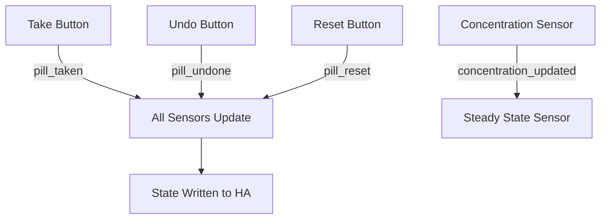

# 💊 Pill Logger

A fully local Home Assistant integration for tracking medications — when you took them, when your next dose is, and whether it's safe to take another. It runs entirely on your instance with no cloud dependency.

If you want to go deeper, Pill Logger can also model how much medication is actually in your body over time using a two-compartment pharmacokinetic engine, track how well your meds are working with custom sliders, and send you mobile reminders when it's time to take a dose.

> ⚠️ **Medical disclaimer:** This integration is for informational and home automation purposes only. It is not a certified medical device. Always follow your doctor's advice and the instructions on your prescription.

---

## Using Pill Logger

### Getting Started

1. **Install** — In HACS, go to ⋮ → Custom Repositories, paste this repository URL, choose **Integration** as the category, then download and restart Home Assistant.
2. **Add a medication** — Head to Settings → Devices & Services → Add Integration and search for **Pill Logger**. The config flow walks you through it in four steps.
3. **Add to your dashboard** — See the [dashboard example](#dashboard-example) below for a ready-made card layout.

### How It Works

Pill Logger supports four ways to track a medication, depending on how you take it:

| Mode | When to Use It | What Happens |
|------|---------------|--------------|
| **Regular Interval** | You take it every N hours (e.g. every 8 hours) | Schedules doses at fixed intervals from midnight. Shows a countdown to your next dose. |
| **Time of Day** | You take it at the same time each day (e.g. 08:30 every morning) | One dose per day at the time you pick. The calendar entity shows daily events. |
| **As Needed (PRN)** | You take it when you need it, but there's a limit (e.g. max 2 in 8 hours) | No fixed schedule — you log doses as you take them. Safe doses enforce a rolling window. |
| **Cyclic / Calendar Pattern** | You take it on a cycle — some days on, some days off (e.g. 5 days on, 2 days off) | Doses only happen on ON days at the time you set. The calendar entity only shows events on ON days. |

### Staying Safe

Accidentally taking too much is easy to do, especially with medications that have a wide dosing window. Pill Logger helps prevent that:

- **Safe Dose Tracking** — You set how many doses are safe within a rolling time window (e.g. max 3 pills in 24 hours). Each pill expires from the window individually, so safe doses recover one at a time. On Cyclic OFF days, safe doses drop to 0 automatically.
- **Overdose Warning** — When safe doses hit 0, the Take button on your dashboard turns red and asks you to confirm before logging.
- **Next Dose Countdown** — The Next Dose sensor tells you exactly when your next dose is available, so you can show live countdowns like "Wait: 2 hours" or "Available now" on your dashboard.

### Pharmacokinetics

If you want to understand what's happening in your body between doses, Pill Logger can optionally model the **amount of medication in your system over time** using a standard two-compartment pharmacokinetic model. When enabled, it creates sensors based on your tracking type:

- **Amount in Body** — Shows current drug amount (mg), updated every 2 minutes, accounting for absorption and elimination. Available for all tracking types.
- **Steady State** — Shows how many days remain until you reach 90% steady state, along with the theoretical maximum and your current percentage. **Only available for scheduled medications** (Regular Interval, Time of Day, Cyclic). Not available for As Needed since steady state requires a fixed dosing interval.

You configure three parameters: **Dose Strength** (mg per pill), **Elimination Half-Life** (hours), and **Time to Peak Concentration** (hours; set to 0 for immediate-release). Leave all three at 0 to disable PK tracking.

> **Note:** The sensor reports **drug amount in the body (mg)**, not blood concentration. Converting to concentration would require the volume of distribution, which varies from person to person. This model is for informational tracking only.

[See the full pharmacokinetics reference ↓](#pharmacokinetics-reference) for the mathematical formulas, worked examples, and scientific methodology.

### Tracking How Well It Works

Not sure if your medication is actually helping? Pill Logger can add 1–10 sliders so you can rate how you feel after each dose:

- **Standard metrics**: Pain, Mood, Nausea, Fatigue
- **Custom metrics**: Add your own (e.g. "brain fog", "joint stiffness") — each one gets its own slider

### At a Glance

Pill Logger gives you a few different ways to look at your dosing history:

- **Adherence Percentage** — Four rolling sensors (7, 14, 30, and 365 days) showing what percentage of scheduled doses you took on time. A dose counts as "on time" if it falls within ±grace period of the expected slot. For Regular Interval mode, adherence is anchored to your actual dosing schedule. Cyclic mode only counts ON days. As Needed medications report `Unavailable` since adherence doesn't really apply without a schedule.
- **Rolling Averages** — Daily average doses over 7, 14, 30, and 365 days. For scheduled modes, averages use schedule-aligned counting with a grace period. As Needed mode uses a simple sliding window.
- **Total Doses** — Cumulative lifetime dose counter.
- **Last Dose** — Timestamp of your most recent dose.

### Inventory & Undo

- **Smart Inventory** — Tracks how many pills you have left. Double-tap the inventory card on your dashboard to open the refill dialog, enter the new box amount, and it automatically adds to your total.
- **Undo Last Dose** — Pressed Take by accident? The Undo button reverts the most recent dose across all sensors, counters, and the PK model — restoring inventory, removing the timestamp, and recalculating the concentration curve from dose history.

### Reminders

There's a ready-made Blueprint you can import for push notifications with Take, Skip, and Snooze actions:

1. Go to Settings → Automations → Blueprints → Import Blueprint
2. Paste: `https://raw.githubusercontent.com/adix992/Home-Assistant-Pill-Logger/main/blueprints/reminder.yaml`
3. Create a new automation from the blueprint, pick your phone, and map your Pill Logger entities.

---

## Building Automations

Each medication shows up as a **Device** in Home Assistant. Replace `ibuprofen` with your medication's entity name in the examples below.

### Sensors

| Sensor | Entity ID | What It Shows | Key Attributes |
|--------|-----------|---------------|----------------|
| Total Doses | `sensor.ibuprofen_total_doses` | Cumulative lifetime dose count | — |
| Last Dose | `sensor.ibuprofen_last_dose` | Timestamp of most recent dose | — |
| Safe Doses | `sensor.ibuprofen_safe_doses` | Remaining safe doses in the current window | `timestamps`, `time_window_hours` |
| Amount in Body | `sensor.ibuprofen_amount_in_body` | Current drug amount in body (mg) — requires PK fields | `last_updated`, `gut_mass`, `ka`, `dose_history` |
| Next Dose | `sensor.ibuprofen_next_dose` | Timestamp of next scheduled dose | `safe_to_take` (number of safe doses remaining now) |
| 7-Day Average | `sensor.ibuprofen_avg_daily_doses_7_days` | Average daily doses over 7 days | `grace_hours` |
| 14-Day Average | `sensor.ibuprofen_avg_daily_doses_14_days` | Average daily doses over 14 days | `grace_hours` |
| 30-Day Average | `sensor.ibuprofen_avg_daily_doses_30_days` | Average daily doses over 30 days | `grace_hours` |
| Yearly Average | `sensor.ibuprofen_avg_daily_doses_yearly` | Average daily doses over 365 days | `grace_hours` |
| 7-Day Adherence | `sensor.ibuprofen_adherence_7_days` | Adherence % over 7 days | `actual_doses`, `expected_doses`, `grace_hours` |
| 14-Day Adherence | `sensor.ibuprofen_adherence_14_days` | Adherence % over 14 days | `actual_doses`, `expected_doses`, `grace_hours` |
| 30-Day Adherence | `sensor.ibuprofen_adherence_30_days` | Adherence % over 30 days | `actual_doses`, `expected_doses`, `grace_hours` |
| 365-Day Adherence | `sensor.ibuprofen_adherence_365_days` | Adherence % over 365 days | `actual_doses`, `expected_doses`, `grace_hours` |
| Steady State | `sensor.ibuprofen_days_to_steady_state` | Days remaining to 90% steady state — scheduled medications only, requires PK fields | `theoretical_max_mg`, `current_percentage`, `last_dose_timestamp` |
| Strength | `sensor.ibuprofen_strength` | Configured per-dose strength (mg) | — |

> **PK fields note:** The Amount in Body sensor only produces meaningful values when **Dose Strength** and **Elimination Half-Life** are configured (non-zero). If left at 0, it reports `0`. The Steady State sensor additionally requires a fixed dosing interval and is only created for scheduled medications (Regular Interval, Time of Day, Cyclic) — it is not available for As Needed medications.

### Buttons

| Button | Entity ID | What It Does |
|--------|-----------|-------------|
| Take | `button.ibuprofen_take` | Log a dose |
| Reset History | `button.ibuprofen_reset_history` | Wipe dose history (keeps inventory) |
| Undo Dose | `button.ibuprofen_undo_dose` | Revert the most recent dose across all sensors and PK model |

### Numbers

| Number | Entity ID | Range | What It Does |
|--------|-----------|-------|-------------|
| Pills Left | `number.ibuprofen_pills_left` | 0–9999 | Current inventory count |
| Add Refill | `number.ibuprofen_add_refill` | 0–∞ | Refill input (auto-resets to 0 after adding) |
| Effectiveness | `number.ibuprofen_{metric}_effectiveness` | 1–10 | Per-metric subjective rating slider |

### Calendar

| Calendar | Entity ID | What It Shows |
|----------|-----------|---------------|
| Dose Calendar | `calendar.ibuprofen_calendar` | Expected dose times on the HA calendar (optional, enabled by default) |

### Events

Pill Logger fires events on the Home Assistant event bus that you can use in automations:

| Event | When It Fires | Event Data |
|-------|--------------|------------|
| `pill_logger_pill_taken` | Any Take button is pressed | `medication_name`, `timestamp` |
| `pill_logger_pill_undone` | Any Undo button is pressed | `medication_name` |

### Automation Examples

**Trigger when a dose is taken:**
```yaml
automation:
  - trigger:
      - platform: event
        event_type: pill_logger_pill_taken
        event_data:
          medication_name: Ibuprofen
    action:
      - service: notify.mobile_app_your_phone
        data:
          message: "Ibuprofen dose logged at {{ trigger.event.data.timestamp }}"
```

**Alert when safe doses reach 0:**
```yaml
automation:
  - trigger:
      - platform: numeric_state
        entity_id: sensor.ibuprofen_safe_doses
        below: 1
    action:
      - service: notify.mobile_app_your_phone
        data:
          message: "⚠️ No safe doses remaining for Ibuprofen"
```

**Notify when steady state is reached** (scheduled medications only):
```yaml
automation:
  - trigger:
      - platform: numeric_state
        entity_id: sensor.ibuprofen_days_to_steady_state
        below: 0.1
    action:
      - service: notify.mobile_app_your_phone
        data:
          message: "✅ Ibuprofen has reached steady state"
```

---

## Dashboard Cards & Templates

### Entity States & Attributes

Key entities and their attributes for template references:

**Safe Doses** (`sensor.ibuprofen_safe_doses`)
- State: number of safe doses remaining (integer)
- `timestamps`: list of recent dose timestamps within the window
- `time_window_hours`: configured rolling window size
- `in_on_window`: (Cyclic only) whether currently in an ON period

**Next Dose** (`sensor.ibuprofen_next_dose`)
- State: datetime of next scheduled dose
- `safe_to_take`: number of safe doses available right now

**Amount in Body** (`sensor.ibuprofen_amount_in_body`)
- State: current drug amount in mg (float, 1 decimal)
- `gut_mass`: drug remaining in gut compartment (mg)
- `ka`: absorption rate constant (h⁻¹)
- `dose_history`: list of `[timestamp, strength]` pairs

**Steady State** (`sensor.ibuprofen_days_to_steady_state`)
- State: days remaining to 90% steady state (float, 1 decimal), or `0.0` if reached
- `theoretical_max_mg`: predicted maximum at steady state
- `current_percentage`: current achievement as a percentage string (e.g. "52.3%")

**Adherence** (`sensor.ibuprofen_adherence_7_days`, etc.)
- State: adherence percentage (integer, clamped at 100%)
- `actual_doses`: number of on-time doses in the window
- `expected_doses`: number of expected doses in the window
- `grace_hours`: configured grace period

### Dashboard Example

Requires [Mushroom Cards](https://github.com/piitaya/lovelace-mushroom), [Vertical Stack In Card](https://github.com/ofekashery/vertical-stack-in-card), and [Card-Mod](https://github.com/thomasloven/lovelace-card-mod) installed via HACS.

Replace **`YOUR_MEDICATION`** with your medication's entity name (e.g. `ibuprofen`).

**💡 How to refill:** Double-click the "Left" card to open the refill dialog, enter the new box amount, and close it to instantly add to your inventory.

```yaml
type: custom:vertical-stack-in-card
cards:
  - type: custom:mushroom-template-card
    entity: sensor.YOUR_MEDICATION_next_dose
    primary: YOUR_MEDICATION
    secondary: >-
      
      
        Available now
      
        
        
        {% set minutes = ((total_seconds % 3600) // 60) | int %}
        Wait: {{ hours }} hours {{ minutes }} minutes
      
    card_mod:
      style: |
        ha-card {
          zoom: 1.2;
        }
  - type: horizontal-stack
    cards:
      - type: vertical-stack
        cards:
          - type: conditional
            conditions:
              - condition: numeric_state
                entity: sensor.YOUR_MEDICATION_safe_doses
                above: 0
            card:
              type: custom:mushroom-template-card
              primary: Take Pill
              secondary: |-
                
                
                  
                  
                  {% set minutes = ((total_seconds % 3600) // 60) | int %}
                  {{ hours }} hours {{ minutes }} minutes ago
                
                  Never ago
                
              icon: mdi:pill
              icon_color: blue
              layout: vertical
              tap_action:
                action: call-service
                service: button.press
                target:
                  entity_id: button.YOUR_MEDICATION_take
              card_mod:
                style: |
                  ha-card {
                    height: 120px !important;
                    display: flex;
                  }
                  ha-card:hover {
                    background: rgba(var(--rgb-blue), 0.1);
                    transition: background 0.2s ease;
                  }
                  ha-card:active {
                    transform: scale(0.95);
                    animation: pulse 0.3s ease;
                  }
                  @keyframes pulse {
                    0% { box-shadow: 0 0 0 0 rgba(var(--rgb-blue), 0.7); }
                    70% { box-shadow: 0 0 0 10px rgba(var(--rgb-blue), 0); }
                    100% { box-shadow: 0 0 0 0 rgba(var(--rgb-blue), 0); }
                  }
          - type: conditional
            conditions:
              - condition: state
                entity: sensor.YOUR_MEDICATION_safe_doses
                state: unknown
            card:
              type: custom:mushroom-template-card
              primary: Take Pill
              secondary: |-
                
                
                  
                  
                  {% set minutes = ((total_seconds % 3600) // 60) | int %}
                  {{ hours }} hours {{ minutes }} minutes ago
                
                  Never ago
                
              icon: mdi:pill
              icon_color: blue
              layout: vertical
              tap_action:
                action: call-service
                service: button.press
                target:
                  entity_id: button.YOUR_MEDICATION_take
              card_mod:
                style: |
                  ha-card {
                    height: 120px !important;
                    display: flex;
                  }
                  ha-card:hover {
                    background: rgba(var(--rgb-blue), 0.1);
                    transition: background 0.2s ease;
                  }
                  ha-card:active {
                    transform: scale(0.95);
                    animation: pulse 0.3s ease;
                  }
                  mushroom-shape-icon {
                    --icon-main-color: var(--rgb-blue) !important;
                    --icon-size: 40px !important;
                  }
                  @keyframes pulse {
                    0% { box-shadow: 0 0 0 0 rgba(var(--rgb-blue), 0.7); }
                    70% { box-shadow: 0 0 0 10px rgba(var(--rgb-blue), 0); }
                    100% { box-shadow: 0 0 0 0 rgba(var(--rgb-blue), 0); }
                  }
          - type: conditional
            conditions:
              - condition: numeric_state
                entity: sensor.YOUR_MEDICATION_safe_doses
                below: 1
            card:
              type: custom:mushroom-template-card
              primary: LIMIT REACHED
              secondary: |-
                
                
                  
                  
                  {% set minutes = ((total_seconds % 3600) // 60) | int %}
                  {{ hours }} hours {{ minutes }} minutes ago
                
                  Never ago
                
              icon: mdi:alert
              icon_color: red
              layout: vertical
              tap_action:
                action: call-service
                service: button.press
                target:
                  entity_id: button.YOUR_MEDICATION_take
                confirmation:
                  text: "WARNING: 0 safe doses available. Override?"
              card_mod:
                style: >
                  ha-card {
                    height: 120px !important;
                    display: flex;
                  }
                  ha-state-icon {
                    display: none !important;
                  }
                  ha-card::after {
                    content: "";
                    position: absolute;
                    top: 0px;
                    left: 50%;
                    transform: translateX(-50%);
                    width: 70px;
                    height: 70px;
                    background-image: url("data:image/svg+xml,%3Csvg xmlns='http://www.w3.org/2000/svg' viewBox='0 0 24 24'%3E%3Cpath fill='%23F44336' d='M13 14H11V9H13M13 18H11V16H13M1 21H23L12 2L1 21Z'/%3E%3C/svg%3E");
                    background-repeat: no-repeat;
                    background-position: center;
                    background-size: 50px 50px;
                    pointer-events: none;
                  }
                  ha-card:hover {
                    background: rgba(var(--rgb-red), 0.1);
                  }
                  ha-card:active {
                    transform: scale(0.95);
                    animation: pulse-red 0.3s ease;
                  }
                  mushroom-shape-icon {
                    --icon-size: 60px !important;
                    --shape-color: rgba(var(--rgb-red), 0.2) !important;
                    --shape-outline-color: rgba(var(--rgb-red), 0.5) !important;
                  }
                  @keyframes pulse-red {
                    0% { box-shadow: 0 0 0 0 rgba(var(--rgb-red), 0.7); }
                    70% { box-shadow: 0 0 0 10px rgba(var(--rgb-red), 0); }
                    100% { box-shadow: 0 0 0 0 rgba(var(--rgb-red), 0); }
                  }
      - type: vertical-stack
        cards:
          - type: custom:mushroom-template-card
            entity: sensor.YOUR_MEDICATION_safe_doses
            primary: Can take
            secondary: "{{ states('sensor.YOUR_MEDICATION_safe_doses') }}"
            icon: mdi:pill
            icon_color: blue
            tap_action:
              action: none
          - type: custom:mushroom-template-card
            entity: number.YOUR_MEDICATION_pills_left
            primary: Left
            secondary: "{{ states('number.YOUR_MEDICATION_pills_left') }}"
            icon: mdi:pill
            icon_color: blue
            tap_action:
              action: none
            double_tap_action:
              action: more-info
              entity: number.YOUR_MEDICATION_add_refill
            card_mod:
              style: |
                ha-card:hover {
                  cursor: pointer;
                  background: rgba(var(--rgb-blue), 0.05);
                }
  - type: conditional
    conditions:
      - condition: numeric_state
        entity: sensor.YOUR_MEDICATION_amount_in_body
        above: 0
    card:
      type: custom:mushroom-template-card
      entity: sensor.YOUR_MEDICATION_amount_in_body
      primary: Amount in body
      secondary: "{{ states('sensor.YOUR_MEDICATION_amount_in_body') }} mg"
      icon: mdi:chart-bell-curve
      icon_color: purple
      tap_action:
        action: more-info
  # Steady State card — only appears for scheduled medications (Regular Interval, Time of Day, Cyclic).
  # As Needed medications do not have a steady state entity.
  - type: conditional
    conditions:
      - condition: state
        entity: sensor.YOUR_MEDICATION_days_to_steady_state
        state_not: unknown
    card:
      type: custom:mushroom-template-card
      entity: sensor.YOUR_MEDICATION_days_to_steady_state
      primary: Steady State
      secondary: >-
        
        
          Reached ✓
        
          {{ ss }} days remaining
        
      icon: mdi:chart-timeline-variant
      icon_color: teal
      tap_action:
        action: more-info
  - type: custom:mushroom-chips-card
    alignment: center
    chips:
      - type: template
        content: "7d Avg: {{ states('sensor.YOUR_MEDICATION_avg_daily_doses_7_days') }}"
        icon: mdi:chart-line
      - type: template
        content: "14d Avg: {{ states('sensor.YOUR_MEDICATION_avg_daily_doses_14_days') }}"
        icon: mdi:chart-line
      - type: template
        content: "30d Avg: {{ states('sensor.YOUR_MEDICATION_avg_daily_doses_30_days') }}"
        icon: mdi:chart-line
      - type: template
        content: "Year Avg: {{ states('sensor.YOUR_MEDICATION_avg_daily_doses_yearly') }}"
        icon: mdi:chart-line
      - type: template
        content: "7d: {{ states('sensor.YOUR_MEDICATION_adherence_7_days') }}%"
        icon: mdi:check-decagram
      - type: template
        content: "14d: {{ states('sensor.YOUR_MEDICATION_adherence_14_days') }}%"
        icon: mdi:check-decagram
      - type: template
        content: "30d: {{ states('sensor.YOUR_MEDICATION_adherence_30_days') }}%"
        icon: mdi:check-decagram
      - type: template
        content: "Total: {{ states('sensor.YOUR_MEDICATION_total_doses') }}"
        icon: mdi:counter
```

### Template Snippets

**Next dose countdown:**
```yaml

Available now

{{ h }}h {{ ((s % 3600) // 60) | int }}m
```

**Time since last dose:**
```yaml



{{ (s // 3600) | int }}h {{ ((s % 3600) // 60) | int }}m ago
Never
```

**Safe doses conditional:**
```yaml

{{ safe }} dose{{ 's' if safe > 1 }} available⚠️ Limit reached
```

**Concentration display:**
```yaml
{{ states('sensor.ibuprofen_amount_in_body') }} mg in body
```

**Steady state display** (scheduled medications only — not available for As Needed):
```yaml

Steady state reached ✓{{ ss }} days to steady state
```

---

## Contributing

### Project Structure

```
custom_components/pill_logger/
├── __init__.py          # Integration entrypoint, platform forwarding, reload handling
├── button.py            # Take, Reset, Undo button entities
├── calendar.py          # Calendar entity for expected dose times
├── config_flow.py       # 4-step config wizard + 3-step options flow
├── const.py             # Domain, logger, effectiveness metrics, sanitize_key()
├── data.py              # Type aliases (PillLoggerConfigEntry, PillLoggerData)
├── entity.py            # Base PillLoggerEntity class
├── manifest.json        # HACS metadata (domain, version, codeowners)
├── number.py            # Inventory, refill, and effectiveness slider entities
├── sensor.py            # Sensor platform orchestrator (creates all sensor instances)
├── strings.json          # English UI strings for config/options flows
├── sensors/
│   ├── adherence.py     # Rolling adherence % (7/14/30/365 days)
│   ├── avg_doses.py      # Rolling daily averages (7/14/30/365 days)
│   ├── concentration.py  # Two-compartment PK model (Bateman equation)
│   ├── last_dose.py      # Most recent dose timestamp
│   ├── next_dose.py      # Next scheduled dose + safe_to_take attribute
│   ├── safe_doses.py     # Sliding window safe dose counter
│   ├── steady_state.py   # Days to 90% steady state
│   ├── strength.py       # Configured per-dose strength (mg)
│   └── total.py          # Lifetime dose counter
└── translations/
    └── en.json           # Runtime English localization (mirrors strings.json)
```

### Architecture Overview



All buttons fire dispatcher signals keyed by `entry_id`. Each sensor listens to the relevant signals and updates its state independently. The concentration sensor additionally broadcasts its current mass to the steady state sensor for real-time recalculation.

### Signal Reference

| Signal | Emitted By | Consumed By | Purpose |
|--------|-----------|-------------|---------|
| `pill_taken_{entry_id}` | Take Button | All sensors, inventory | Log a dose and trigger recalculation |
| `pill_reset_{entry_id}` | Reset Button | All sensors, inventory | Clear all history and reset counters |
| `pill_undone_{entry_id}` | Undo Button | All sensors, inventory | Revert the most recent dose |
| `pill_add_stock_{entry_id}` | Refill Number | Inventory | Add a refill amount |
| `concentration_updated_{entry_id}` | Concentration Sensor | Steady State Sensor | Push live drug mass for steady-state recalculation |

Home Assistant event bus events (for automations):

| Event | Fired By | Data |
|-------|---------|------|
| `pill_logger_pill_taken` | Take Button | `medication_name`, `timestamp` |
| `pill_logger_pill_undone` | Undo Button | `medication_name` |

### Config Flow Architecture

**Initial setup (4 steps):**
1. `user` → choose name + tracking type
2. `regular_interval` / `time_of_day` / `as_needed` / `cyclic` → schedule & dosing parameters
3. `pk` → pharmacokinetic parameters (strength, half-life, hours to peak)
4. `effectiveness` → metrics toggles + adherence settings

**Options flow (3 steps):**
1. `init` → schedule & dosing (varies by tracking type)
2. `pk` → pharmacokinetic parameters
3. `effectiveness` → metrics toggles + adherence settings

### Development Setup

1. Clone this repository into your Home Assistant `custom_components/` directory
2. Install the dev container: `.devcontainer/devcontainer.json` is provided
3. Run `scripts/setup` to install dependencies
4. Run `scripts/lint` to check code quality
5. Use `scripts/develop` to start a local Home Assistant instance with the integration loaded

---

## Configuration Reference

### Step 1: Add a Medication

| Field | Type | Description | Default |
|-------|------|-------------|---------|
| Medication Name | Text | Display name for the device | My Medication |
| Tracking Type | Dropdown | Choose a tracking mode (descriptions shown inline) | Regular Interval |

> The medication name and tracking type can't be changed after creation. To switch, remove the entry and create a new one.

### Step 2: Schedule & Dosing

#### Regular Interval

| Field | Range | Description | Default |
|-------|-------|-------------|---------|
| Inventory | 0–9999 pills | Number of pills currently available | 30 |
| Dose Interval | 1–48 h | Minimum hours between consecutive doses | 8 |
| Safe Doses | 1–20 doses | Maximum doses allowed within the time window | 1 |
| Time Window | 0.5–168 h | Rolling window for safe dose calculation | 8 |
| Calendar Entity | Toggle | Show expected dose times on the HA calendar | On |

#### Time of Day

| Field | Range | Description | Default |
|-------|-------|-------------|---------|
| Inventory | 0–9999 pills | Number of pills currently available | 30 |
| Dose Time | Time picker | Time of day to take the medication | 08:00 |
| Safe Doses | 1–20 doses | Maximum doses allowed within the time window | 1 |
| Time Window | 0.5–168 h | Rolling window for safe dose calculation | 24 |
| Calendar Entity | Toggle | Show expected dose times on the HA calendar | On |

#### As Needed (PRN)

| Field | Range | Description | Default |
|-------|-------|-------------|---------|
| Inventory | 0–9999 pills | Number of pills currently available | 30 |
| Safe Doses | 1–20 doses | Maximum doses allowed within the time window | 2 |
| Time Window | 0.5–168 h | Rolling window for safe dose calculation | 8 |
| Calendar Entity | Toggle | Show expected dose times on the HA calendar | On |

#### Cyclic / Calendar Pattern

| Field | Range | Description | Default |
|-------|-------|-------------|---------|
| Inventory | 0–9999 pills | Number of pills currently available | 30 |
| Days On | 1–30 days | Number of active days in the cycle | 5 |
| Days Off | 1–30 days | Number of rest days in the cycle | 2 |
| Cycle Start Date | Date picker | Start date of the on/off cycle | Today |
| Dose Time | Time picker | Time of day to take on active days | 08:00 |
| Safe Doses | 1–20 doses | Maximum doses allowed within the time window | 1 |
| Time Window | 0.5–168 h | Rolling window for safe dose calculation | 24 |
| Calendar Entity | Toggle | Show expected dose times on the HA calendar | On |

### Step 3: Pharmacokinetics

| Field | Range | Description | Default |
|-------|-------|-------------|---------|
| Dose Strength | 0–9999 mg | Amount of medication per dose. Set to 0 if not tracking concentration. | 0 |
| Elimination Half-Life | 0–168 h | Time for the body to eliminate half the drug. Set to 0 if not tracking concentration. | 0 |
| Time to Peak Concentration | 0–72 h | Hours after taking until concentration peaks. Set to 0 for immediate-release medications. | 0 |

> Leave all values at 0 if you don't need concentration tracking. The Amount in Body sensor will report `0` when PK fields are not configured. The Steady State sensor is only created for scheduled medications (Regular Interval, Time of Day, Cyclic) — it is not available for As Needed medications.

### Step 4: Metrics & Adherence

| Field | Type | Description | Default |
|-------|------|-------------|---------|
| Pain | Toggle | Enable a 1–10 slider for pain | Off |
| Mood | Toggle | Enable a 1–10 slider for mood | Off |
| Nausea | Toggle | Enable a 1–10 slider for nausea | Off |
| Fatigue | Toggle | Enable a 1–10 slider for fatigue | Off |
| Custom Metrics | Text | Separate multiple with commas (e.g. brain fog, joint stiffness). A 1–10 slider is created for each. | — |
| Track Dose Adherence | Toggle | Show how consistently you take doses on time. Creates 7, 14, 30, and 365-day adherence sensors. | On (Off for As Needed) |
| On-Time Window | 0.5–24 h | How early or late a dose can be and still count as on-time. For example, 1 hour means ±1 hour around the scheduled time. | 1 |

### Reconfiguring After Setup

Click **Configure** on the integration entry to change settings without recreating the medication. The reconfiguration flow has 3 steps:

**Step 1: Schedule & Dosing** (fields vary by tracking type — same as Step 2 above)

**Step 2: Pharmacokinetics** (same as Step 3 above)

**Step 3: Metrics & Adherence** (same as Step 4 above)

> **Note:** The medication name and tracking type can't be changed after creation.

---

## Pharmacokinetics Reference

This section covers the complete mathematical methodology behind Pill Logger's pharmacokinetic model. All calculations are transparent and evidence-based, using the standard two-compartment framework from clinical pharmacokinetics.

### The Two-Compartment Model

When you take a pill, the drug doesn't instantly appear in your bloodstream. It must first be absorbed from the gastrointestinal tract. Pill Logger models this as two compartments:

```
┌─────────┐    absorption (kₐ)    ┌─────────┐    elimination (kₑ)    ┌─────┐
│   Gut   │ ───────────────────▶ │  Body   │ ──────────────────────▶ │ Out │
│  (mg)   │                       │  (mg)   │                         │     │
└─────────┘                       └─────────┘                         └─────┘
```

- **Gut compartment**: Drug waiting to be absorbed. Decays exponentially as drug moves into the body.
- **Body compartment**: Drug currently in your system. Increases from absorption, decreases from elimination.

### Parameters You Configure

| Parameter | What It Means | Example |
|-----------|--------------|---------|
| **Dose Strength (D)** | Milligrams per pill | 200 mg |
| **Elimination Half-Life (t½)** | Time for the body to eliminate half the drug | 2 hours |
| **Time to Peak Concentration (t_max)** | Hours after taking until the drug amount in the body is highest | 1.5 hours |

### How the Absorption Rate Is Calculated

The elimination rate constant is derived directly from the half-life:

> **kₑ = ln(2) / t½**

The absorption rate constant **kₐ** cannot be solved in closed form from t_max. Instead, it's found numerically using the standard pharmacokinetic relationship (Rowland & Tozer, 2011):

> **t_max = ln(kₐ / kₑ) / (kₐ − kₑ)**

Pill Logger solves this equation using a binary search over kₐ ��� [0.0001, 20.0] with 50 iterations, which converges to within 0.001% accuracy.

### The Bateman Equation

For a single dose of strength **D** at time t = 0, the amount of drug in the body at time **t** is given by the **Bateman equation**:

**General case (kₐ ≠ kₑ):**

> C(t) = D × kₐ / (kₐ − kₑ) × (e^(−kₑ·t) − e^(−kₐ·t))

**Limiting case (kₐ ≈ kₑ):**

> C(t) = D × kₐ × t × e^(−kₐ·t)

The gut compartment decays independently:

> G(t) = D × e^(−kₐ·t)

When a dose is taken while drug from a previous dose is still in the gut, the body compartment receives an additional contribution from the remaining gut mass:

> Body contribution from gut = G₀ × kₐ / (kₐ − kₑ) × (e^(−kₑ·t) − e^(−kₐ·t))

### Immediate Release Mode

When **t_max = 0**, the dose enters the body directly with no absorption phase. This is appropriate for sublingual, IV, or fast-dissolving formulations. The formula simplifies to:

> C(t) = D × e^(−kₑ·t)

The gut compartment is bypassed entirely (G = 0 at all times).

### Multi-Dose Superposition

Because the two-compartment model is **linear**, the total drug amount at any time equals the sum of each individual dose's contribution:

> C_total(t) = Σᵢ Cᵢ(t − tᵢ)

where **tᵢ** is the time of dose **i** and **Cᵢ** is the Bateman equation applied to that dose.

This is **mathematically exact** — Pill Logger stores the complete dose history and recalculates from scratch on every update, eliminating floating-point drift. When you undo a dose, the last entry is removed and the entire model is recalculated from the remaining history.

### Worked Example: Ibuprofen 200 mg

**Configuration:** D = 200 mg, t½ = 2 h, t_max = 1.5 h, dosing interval τ = 6 h

**Step 1 — Elimination rate:**
> kₑ = ln(2) / 2 = 0.347 h⁻¹

**Step 2 — Absorption rate (solved numerically):**
> kₐ ≈ 1.15 h⁻¹ (satisfies t_max = ln(1.15/0.347) / (1.15 − 0.347) ≈ 1.5 h)

**Step 3 — Single dose at t = 0:**

At peak (t = 1.5 h):
> C(1.5) = 200 × 1.15/(1.15 − 0.347) × (e^(−0.347×1.5) − e^(−1.15×1.5))
> = 200 × 1.432 × (0.595 − 0.178)
> = 200 × 1.432 × 0.417
> ≈ **119 mg** in the body

Just before the second dose (t = 6 h):
> C(6) = 200 × 1.432 × (e^(−2.08) − e^(−6.9))
> = 200 × 1.432 × (0.125 − 0.001)
> ≈ **35.5 mg** remaining from the first dose

**Step 4 — Second dose at t = 6 h (superposition):**

At the moment of the second dose, the body still holds ~35.5 mg from the first dose. The new 200 mg enters the gut and begins absorbing. The total body amount is the sum of both contributions at every future time point.

**Step 5 — Steady state accumulation factor:**
> R = 1 / (1 − e^(−0.347 × 6)) = 1 / (1 − 0.125) ≈ **1.14**
> C_max_ss = 200 × 1.14 ≈ **228 mg**

This means at steady state, the peak amount in the body reaches approximately 228 mg — only 14% more than a single dose, because ibuprofen's 2-hour half-life allows significant elimination between doses.

### Steady State Tracking

> **Availability:** The Steady State sensor is only created for **scheduled medications** (Regular Interval, Time of Day, Cyclic). It is not available for As Needed medications because steady state requires a fixed dosing interval (τ), which PRN medications do not have.

The Steady State sensor calculates how many days remain until you reach 90% of pharmacokinetic steady state.

**Accumulation factor:**
> R = 1 / (1 − e^(−kₑ × τ))

where **τ** is the dosing interval (hours between doses).

**Theoretical maximum at steady state:**
> C_max_ss = D × R

The sensor reports one of three cases:

| Current State | Calculation | Result |
|---------------|-------------|--------|
| **Above 110% of C_max_ss** (e.g. after a dosage reduction) | t = ln(C_current / (0.9 × C_max_ss)) / kₑ | Days until drug drops to 90% of the new steady state |
| **Within 90–110% of C_max_ss** | — | `0.0` — steady state reached ✓ |
| **Below 90% of C_max_ss** | remaining = (t₉₀ − t_current) / 24, where t₉₀ = −ln(0.1)/kₑ and t_current = −ln(1−p)/kₑ | Days until 90% is achieved |

**Attributes exposed:** `theoretical_max_mg`, `current_percentage`, `last_dose_timestamp`

> **Note:** The 90% threshold is the standard clinical convention — steady state is considered achieved after 4–5 half-lives, which corresponds to 93.75%–96.88% accumulation. The sensor uses 90% as a conservative milestone.

### Worked Example: Steady State Calculation

Using the same ibuprofen configuration (t½ = 2 h, τ = 6 h):

**After 1 dose (at peak, t = 1.5 h):**
- Current body amount ≈ 119 mg
- Percentage of steady state: 119 / 228 ≈ **52%**

**After 1 dose (just before 2nd dose, t = 6 h):**
- Current body amount ≈ 35.5 mg
- Percentage of steady state: 35.5 / 228 ≈ **16%**

**Time to reach 90% steady state from zero:**
> t₉₀ = −ln(0.1) / kₑ = 2.303 / 0.347 ≈ 6.6 hours ≈ **0.3 days**

In practice, with repeated dosing every 6 hours, steady state is reached within **approximately 8–10 hours** (4–5 half-lives × 2 h = 8–10 h), which the sensor calculates dynamically based on your actual dosing history.

### Scientific References

- Rowland, M., & Tozer, T.N. (2011). *Clinical Pharmacokinetics and Pharmacodynamics: Concepts and Applications*. Lippincott Williams & Wilkins.
- Gabrielsson, J., & Weiner, D. (2016). *Pharmacokinetic and Pharmacodynamic Data Analysis: Concepts and Applications*. Apotekarsocieteten.

---

*This integration is for informational and home automation purposes only. It is not a certified medical device. Always follow your doctor's advice and the instructions on your prescription.*
