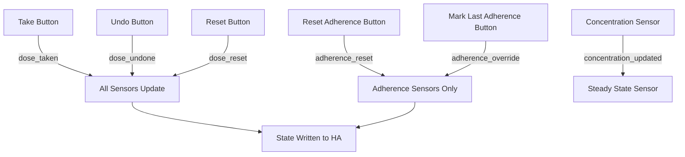

# 💊 AX Dose Logger

A fully local Home Assistant integration for tracking medications — when you took them, when your next dose is, and whether it's safe to take another. It runs entirely on your instance with no cloud dependency.

If you want to go deeper, AX Dose Logger can also model how much medication is actually in your body over time using pharmacokinetic engines for both instant-release and sustained-release formulations, track how well your meds are working with custom sliders, and send you mobile reminders when it's time to take a dose.

> ⚠️ **Medical disclaimer:** This integration is for informational and home automation purposes only. It is not a certified medical device. Always follow your doctor's advice and the instructions on your prescription.

---

## Using AX Dose Logger

### Getting Started

1. **Install** — In HACS, go to ⋮ → Custom Repositories, paste this repository URL, choose **Integration** as the category, then download and restart Home Assistant.
2. **Add a medication** — Head to Settings → Devices & Services → Add Integration and search for **AX Dose Logger**. The config flow walks you through it in four steps.

<!-- SCREENSHOT: The 4-step AX Dose Logger config flow — capture step 1 (name + tracking type + release type) or a composite of all 4 steps -->


3. **Add to your dashboard** — Install the dedicated [AX Dose Logger Card](#dashboard-card) and add it to your dashboard. No template YAML required.

### How It Works

AX Dose Logger supports four ways to track a medication, depending on how you take it:

| Mode | When to Use It | What Happens |
|------|---------------|--------------|
| **Regular Interval** | You take it every N hours (e.g. every 8 hours) | Schedules doses at fixed intervals from midnight. Shows a countdown to your next dose. |
| **Time of Day** | You take it at the same time each day (e.g. 08:30 every morning) | One dose per day at the time you pick. The calendar entity shows daily events. |
| **As Needed (PRN)** | You take it when you need it, but there's a limit (e.g. max 2 in 8 hours) | No fixed schedule — you log doses as you take them. The pill limit enforces a rolling window. |
| **Cyclic / Calendar Pattern** | You take it on a cycle — some days on, some days off (e.g. 5 days on, 2 days off) | Doses only happen on ON days at the time you set. The calendar entity only shows events on ON days. |

### Staying Safe

Accidentally taking too much is easy to do, especially with medications that have a wide dosing window. AX Dose Logger helps prevent that:

- **Pill Limit Tracking** — You set how many pills are safe within a rolling time window (e.g. max 3 pills in 24 hours). Each pill expires from the window individually, so the limit recovers one at a time. On Cyclic OFF days, the limit drops to 0 automatically.
- **Overdose Warning** — When the pill limit hits 0, the Take button on the dedicated AX Dose Logger Card turns red and asks you to confirm before logging.

<!-- SCREENSHOT: Daily pane with pill limit at 0 — Take button red with the confirmation dialog visible -->


- **Next Dose Countdown** — The Next Dose sensor tells you exactly when your next scheduled dose is, so you can show live countdowns like "in 2 hours" or "Available now" on your dashboard. For scheduled medications (Time of Day, Cyclic), the next dose always reflects your prescribed clock time — taking a dose late does not drift the schedule. The separate Pills Safe to Take sensor tells you whether it's actually safe to take now.

### Pharmacokinetics

If you want to understand what's happening in your body between doses, AX Dose Logger can optionally model the **amount of medication in your system over time** using pharmacokinetic models. When enabled, it creates sensors based on your tracking type:

- **Amount in Body** — Shows current drug amount (mg), updated every 2 minutes, accounting for absorption and elimination. Available for all tracking types.
- **Steady State** — Shows how many days remain until you reach 90% steady state, along with the theoretical maximum and your current percentage. **Only available for scheduled medications** (Regular Interval, Time of Day, Cyclic). Not available for As Needed since steady state requires a fixed dosing interval.

You choose a **Release Type** when adding a medication — **Instant Release** or **Sustained Release** — and then configure the appropriate parameters:

- **Instant Release** — Three parameters: **Dose Strength** (mg), **Elimination Half-Life** (h), and **Time to Peak Concentration** (h; set to 0 for immediate-release). Uses a standard two-compartment (Bateman) model. An optional **Lag Time** (min) can model delayed-release formulations.
- **Sustained Release** — Adds **Bioavailability** (%), **Initial Release** (%), **Sustained Release Duration** (h), **Release Half-Life** (h), and **Lag Time** (min) to model hybrid extended-release formulations with both fast-acting and slow-release components.

Leave all PK values at 0 to disable concentration tracking.

> **Note:** The sensor reports **drug amount in the body (mg)**, not blood concentration. Converting to concentration would require the volume of distribution, which varies from person to person. This model is for informational tracking only.

[See the full pharmacokinetics reference ↓](#pharmacokinetics-reference) for the mathematical formulas, worked examples, and scientific methodology.

### Tracking How Well It Works

Not sure if your medication is actually helping? AX Dose Logger can add 1–10 sliders so you can rate how you feel after each dose:

- **Standard metrics**: Pain, Mood, Nausea, Fatigue
- **Custom metrics**: Add your own (e.g. "brain fog", "joint stiffness") — each one gets its own slider

### At a Glance

AX Dose Logger gives you a few different ways to look at your dosing history:

- **Adherence Percentage** — Four rolling sensors (7, 14, 30, and 365 days) showing what percentage of scheduled doses you took on time. A dose counts as "on time" if it falls within ±grace period of the expected slot. For Regular Interval mode, adherence is anchored to your actual dosing schedule. Cyclic mode only counts ON days. As Needed medications report `Unavailable` since adherence doesn't really apply without a schedule.
- **Rolling Averages** — Day-level dose coverage over 7, 14, 30, and 365 days (PDC-aligned: the fraction of scheduled days in the window on which at least one dose was taken, 0.0–1.0). Windows are anchored to your first recorded dose, so setting up a medication before you start taking it doesn't penalize the averages. A dose taken at any time on a scheduled day counts that day as covered — a late-but-taken dose does not lower the average. Cyclic mode only counts ON days. Timing quality (on-time vs late) is reported separately by the Adherence Percentage sensors.
- **Total Doses** — Cumulative lifetime dose counter.
- **Last Dose** — Timestamp of your most recent dose.

### Inventory & Undo

- **Smart Inventory** — Tracks how many pills you have left. Double-tap the inventory tile on the AX Dose Logger Card to open the refill dialog, enter the new box amount, and it automatically adds to your total.

<!-- SCREENSHOT: Double-tap on the inventory tile showing the refill input dialog -->


- **Undo Last Dose** — Pressed Take by accident? The Undo button reverts the most recent dose across all sensors, counters, and the PK model — restoring inventory, removing the timestamp, and recalculating the concentration curve from dose history.

### Reminders

There's a ready-made Blueprint you can import for push notifications with Take, Skip, and Snooze actions:

1. Go to Settings → Automations → Blueprints → Import Blueprint
2. Paste: `https://raw.githubusercontent.com/Axildor/AX-Dose-Logger/main/blueprints/reminder.yaml`
3. Create a new automation from the blueprint, pick your phone, and map your AX Dose Logger entities.

> **Safety guard**: The blueprint has an optional "Pills Safe to Take Sensor" input. When mapped, the notification's **Taken** action will not auto-log a dose if you're at the pill limit — instead it sends a warning telling you to open the AX Dose Logger card to override. This keeps the notification from bypassing the rolling-window overdose protection.

---

## Dashboard Card

AX Dose Logger has a dedicated Lovelace card that surfaces everything the integration produces — no template YAML, no Mushroom/Card-Mod dependencies. It's a separate repository, installed via HACS as a **Dashboard** card.

> **Note:** The card repository link below is a placeholder — the dedicated card integration is not live yet.

**Install:** `https://github.com/Axildor/AX-Dose-Logger-Card` (HACS → Custom Repositories → Dashboard category)

Once installed, add it to your dashboard via the visual editor (pick your medication device) or with simple YAML:

```yaml
type: custom:ax-dose-logger-card
device_id: <your medication device ID>
```

The card has four panes, selectable via tabs at the bottom:

### 📅 Daily

<!-- SCREENSHOT: Card showing the Daily pane — medication name, Take Pill button with next-dose countdown, pills safe to take, last dose, inventory count, custom chips -->


- Take Pill button with next-dose countdown
- Pills safe to take indicator
- Last dose timestamp
- Inventory count (double-tap to refill)
- Custom chips for any related entities

### 📊 Graphs

<!-- SCREENSHOT: Card showing the Graphs pane — daily-dose bar graph with timescale selector + amount-in-body line graph with timeframe selector -->


- Bar graph of daily doses with selectable timescales (14D, 30D, 60D)
- Amount-in-body line graph with selectable timeframes (12H, 48H, 7D, 14D, 30D)

### 📈 Stats

<!-- SCREENSHOT: Card showing the Stats pane — rolling average boxes (7/14/30/365 days), adherence percentage boxes, total doses, days since first dose -->


- Rolling averages (7, 14, 30, 365 days)
- Adherence percentages (7, 14, 30, 365 days)
- Total doses and days since first dose

### 🔧 Tools

<!-- SCREENSHOT: Card showing the Tools pane — Reset Adherence %, Mark Last Adherence Taken, Reset History, Undo Last Dose buttons -->


- Reset adherence percentage
- Mark last missed dose as taken
- Reset dose history
- Undo last dose

For full card configuration options (color schemes, column layouts, chip customization, graph toggles), see the card repository's README.

---

## Entity States & Attributes

> This section is for advanced users who want to build custom templates beyond the dedicated AX Dose Logger Card. The card handles all of this automatically — you only need these details if you're hand-rolling your own Lovelace templates.

Key entities and their attributes for template references:

**Pills Safe to Take** (`sensor.ibuprofen_pills_safe_to_take`)
- State: number of pills safe to take remaining (integer)
- `timestamps`: list of recent dose timestamps within the window
- `time_window_hours`: configured rolling window size
- `in_on_window`: (Cyclic only) whether currently in an ON period
- `window_expires_at`: when the oldest in-window dose expires and the limit will increment (ISO datetime); `null` when not at the limit. This is the true "when can I safely take another" time, distinct from the Next Dose schedule.

**Next Dose** (`sensor.ibuprofen_next_dose`)
- State: datetime of next scheduled dose. For scheduled medications (Time of Day, Cyclic), this is always the next prescribed clock slot — taking a dose late does not drift the schedule. The safety gate (whether it's actually safe to take now) is the separate Pills Safe to Take sensor.
- `safe_to_take`: number of pills safe to take right now

**Amount in Body** (`sensor.ibuprofen_amount_in_body`)
- State: current drug amount in mg (float, 1 decimal)
- *Instant Release attributes:*
  - `gut_mass`: drug remaining in gut compartment (mg)
  - `ka`: absorption rate constant (h⁻¹)
  - `lag_time`: configured lag time (min)
  - `dose_history`: list of `[timestamp, strength]` pairs
- *Sustained Release attributes:*
  - `gut_ir_mass`: drug in IR gut compartment (mg)
  - `matrix_sr_mass`: drug remaining in SR matrix (mg)
  - `gut_sr_mass`: drug in SR gut compartment (mg)
  - `ka`: absorption rate constant (h⁻¹)
  - `kr`: SR release rate constant (h⁻¹)
  - `lag_time`: configured lag time (min)
  - `dose_history`: list of `[timestamp, strength]` pairs

**Steady State** (`sensor.ibuprofen_days_to_steady_state`)
- State: days remaining to 90% steady state (float, 1 decimal), or `0.0` if reached
- `theoretical_max_mg`: predicted maximum at steady state
- `current_percentage`: current achievement as a percentage string (e.g. "52.3%")

**Adherence** (`sensor.ibuprofen_adherence_7_days`, etc.)
- State: adherence percentage (integer, clamped at 100%)
- `actual_doses`: number of on-time doses in the window
- `expected_doses`: number of expected doses in the window
- `grace_hours`: configured grace period

---

## Building Automations

Each medication shows up as a **Device** in Home Assistant. Replace `ibuprofen` with your medication's entity name in the examples below.

### Sensors

| Sensor | Entity ID | What It Shows | Key Attributes |
|--------|-----------|---------------|----------------|
| Total Doses | `sensor.ibuprofen_total_doses` | Cumulative lifetime dose count | — |
| Days Since First Dose | `sensor.ibuprofen_days_since_first_dose` | Integer days elapsed since the first recorded dose | `first_dose_timestamp`, `history_start_date` |
| Last Dose | `sensor.ibuprofen_last_dose` | Timestamp of most recent dose | — |
| Pills Safe to Take | `sensor.ibuprofen_pills_safe_to_take` | Remaining pills safe to take in the current window | `timestamps`, `time_window_hours`, `window_expires_at` (when the limit resets; `null` if not at the limit) |
| Amount in Body | `sensor.ibuprofen_amount_in_body` | Current drug amount in body (mg) — requires PK fields | `last_updated`, `gut_mass`, `ka`, `lag_time`, `dose_history` (IR); `gut_ir_mass`, `matrix_sr_mass`, `gut_sr_mass`, `ka`, `kr`, `lag_time`, `dose_history` (ER) |
| Next Dose | `sensor.ibuprofen_next_dose` | Timestamp of next scheduled dose | `safe_to_take` (number of pills safe to take remaining now) |
| 7-Day Average | `sensor.ibuprofen_avg_daily_doses_7_days` | Day-level dose coverage over 7 days (0.0–1.0) | `covered_days`, `scheduled_days`, `effective_window_days` |
| 14-Day Average | `sensor.ibuprofen_avg_daily_doses_14_days` | Day-level dose coverage over 14 days (0.0–1.0) | `covered_days`, `scheduled_days`, `effective_window_days` |
| 30-Day Average | `sensor.ibuprofen_avg_daily_doses_30_days` | Day-level dose coverage over 30 days (0.0–1.0) | `covered_days`, `scheduled_days`, `effective_window_days` |
| Yearly Average | `sensor.ibuprofen_avg_daily_doses_yearly` | Day-level dose coverage over 365 days (0.0–1.0) | `covered_days`, `scheduled_days`, `effective_window_days` |
| 7-Day Adherence | `sensor.ibuprofen_adherence_7_days` | Adherence % over 7 days | `actual_doses`, `expected_doses`, `grace_hours` |
| 14-Day Adherence | `sensor.ibuprofen_adherence_14_days` | Adherence % over 14 days | `actual_doses`, `expected_doses`, `grace_hours` |
| 30-Day Adherence | `sensor.ibuprofen_adherence_30_days` | Adherence % over 30 days | `actual_doses`, `expected_doses`, `grace_hours` |
| 365-Day Adherence | `sensor.ibuprofen_adherence_365_days` | Adherence % over 365 days | `actual_doses`, `expected_doses`, `grace_hours` |
| Steady State | `sensor.ibuprofen_days_to_steady_state` | Days remaining to 90% steady state — scheduled medications only, requires PK fields | `theoretical_max_mg`, `current_percentage`, `last_dose_timestamp` |
| Strength | `sensor.ibuprofen_strength` | Configured per-dose strength (mg) | — |

> **PK fields note:** The Amount in Body sensor only produces meaningful values when **Dose Strength** and **Elimination Half-Life** are configured (non-zero). If left at 0, it reports `0`. The Steady State sensor additionally requires a fixed dosing interval and is only created for scheduled medications (Regular Interval, Time of Day, Cyclic) — it is not available for As Needed medications.

### Buttons

| Button | Entity ID | What It Does |
|--------|-----------|-------------|
| Take | `button.ibuprofen_take` | Log a dose |
| Reset History | `button.ibuprofen_reset_history` | Wipe dose history (keeps inventory) |
| Undo Dose | `button.ibuprofen_undo_dose` | Revert the most recent dose across all sensors and PK model |
| Reset Adherence % | `button.ibuprofen_reset_adherence` | Clear adherence percentage history only — does NOT affect Amount in Body, dose count, or any other sensor |
| Mark Last Adherence Taken | `button.ibuprofen_cover_last_missed` | Mark the most recent missed dose slot as taken for adherence calculation only — does NOT add a dose to the PK model or dose count |

### Numbers

| Number | Entity ID | Range | What It Does |
|--------|-----------|-------|-------------|
| Pills Left | `number.ibuprofen_pills_left` | 0–9999 | Current inventory count |
| Add Refill | `number.ibuprofen_add_refill` | 0–∞ | Refill input (auto-resets to 0 after adding) |
| Effectiveness | `number.ibuprofen_{metric}_effectiveness` | 1–10 | Per-metric subjective rating slider |

### Calendar

| Calendar | Entity ID | What It Shows |
|----------|-----------|---------------|
| Dose Calendar | `calendar.ibuprofen_calendar` | Expected dose times on the HA calendar (optional, enabled by default) |

### Events

AX Dose Logger fires events on the Home Assistant event bus that you can use in automations:

| Event | When It Fires | Event Data |
|-------|--------------|------------|
| `ax_dose_logger_dose_taken` | Any Take button is pressed | `medication_name`, `timestamp` |
| `ax_dose_logger_dose_undone` | Any Undo button is pressed | `medication_name` |
| `ax_dose_logger_adherence_override` | Mark Last Adherence Taken button is pressed | `entity_id` |

### Automation Examples

**Trigger when a dose is taken:**
```yaml
automation:
  - trigger:
      - platform: event
        event_type: ax_dose_logger_dose_taken
        event_data:
          medication_name: Ibuprofen
    action:
      - service: notify.mobile_app_your_phone
        data:
          message: "Ibuprofen dose logged at {{ trigger.event.data.timestamp }}"
```

**Alert when pill limit reaches 0:**
```yaml
automation:
  - trigger:
      - platform: numeric_state
        entity_id: sensor.ibuprofen_pills_safe_to_take
        below: 1
    action:
      - service: notify.mobile_app_your_phone
        data:
          message: "⚠️ No pills safe to take for Ibuprofen"
```

**Notify when steady state is reached** (scheduled medications only):
```yaml
automation:
  - trigger:
      - platform: numeric_state
        entity_id: sensor.ibuprofen_days_to_steady_state
        below: 0.1
    action:
      - service: notify.mobile_app_your_phone
        data:
          message: "✅ Ibuprofen has reached steady state"
```

---

## Contributing

### Project Structure

```
custom_components/ax_dose_logger/
├── __init__.py          # Integration entrypoint, platform forwarding, reload handling
├── button.py            # Take, Reset, Undo, Reset Adherence %, Mark Last Adherence Taken button entities
├── calendar.py          # Calendar entity for expected dose times
├── config_flow.py       # 4-step config wizard + 3-step options flow
├── const.py             # Domain, logger, effectiveness metrics, release types, PK defaults
├── data.py              # Type aliases (AxDoseLoggerConfigEntry, AxDoseLoggerData)
├── entity.py            # Base AxDoseLoggerEntity class
├── manifest.json        # HACS metadata (domain, version, codeowners)
├── number.py            # Inventory, refill, and effectiveness slider entities
├── sensor.py            # Sensor platform orchestrator (creates all sensor instances)
├── strings.json          # English UI strings for config/options flows
├── sensors/
│   ├── adherence.py     # Rolling adherence % (7/14/30/365 days)
│   ├── avg_doses.py      # Rolling daily averages (7/14/30/365 days)
│   ├── concentration.py  # PK model (Bateman IR + hybrid ER 4-compartment)
│   ├── last_dose.py      # Most recent dose timestamp
│   ├── next_dose.py      # Next scheduled dose + safe_to_take attribute
│   ├── pill_limit.py      # Sliding window pill limit counter
│   ├── steady_state.py   # Days to 90% steady state (with bioavailability scaling)
│   ├── strength.py       # Configured per-dose strength (mg)
│   └── total.py          # Lifetime dose counter
└── translations/
    └── en.json           # Runtime English localization (mirrors strings.json)
```

### Architecture Overview



All buttons fire dispatcher signals keyed by `entry_id`. Each sensor listens to the relevant signals and updates its state independently. The concentration sensor additionally broadcasts its current mass to the steady state sensor for real-time recalculation.

### Signal Reference

| Signal | Emitted By | Consumed By | Purpose |
|--------|-----------|-------------|---------|
| `pill_taken_{entry_id}` | Take Button | All sensors, inventory | Log a dose and trigger recalculation |
| `pill_reset_{entry_id}` | Reset Button | All sensors, inventory | Clear all history and reset counters |
| `pill_undone_{entry_id}` | Undo Button | All sensors, inventory | Revert the most recent dose |
| `pill_adherence_reset_{entry_id}` | Reset Adherence % Button | Adherence sensors only | Clear adherence timestamps without affecting PK or other sensors |
| `pill_adherence_override_{entry_id}` | Mark Last Adherence Taken Button | Adherence sensors only | Cover the most recent missed dose slot for adherence only |
| `pill_add_stock_{entry_id}` | Refill Number | Inventory | Add a refill amount |
| `concentration_updated_{entry_id}` | Concentration Sensor | Steady State Sensor | Push live drug mass for steady-state recalculation |

Home Assistant event bus events (for automations):

| Event | Fired By | Data |
|-------|---------|------|
| `ax_dose_logger_dose_taken` | Take Button | `medication_name`, `timestamp` |
| `ax_dose_logger_dose_undone` | Undo Button | `medication_name` |
| `ax_dose_logger_adherence_override` | Mark Last Adherence Taken Button | `entity_id` |

### Config Flow Architecture

**Initial setup (4 steps):**
1. `user` → choose name + tracking type + release type
2. `regular_interval` / `time_of_day` / `as_needed` / `cyclic` → schedule & dosing parameters
3. `pk` → pharmacokinetic parameters (varies by release type)
4. `effectiveness` → metrics toggles + adherence settings

**Options flow (3 steps):**
1. `init` → schedule & dosing (varies by tracking type)
2. `pk` → pharmacokinetic parameters (varies by release type)
3. `effectiveness` → metrics toggles + adherence settings

### Development Setup

1. Clone this repository into your Home Assistant `custom_components/` directory
2. Install the dev container: `.devcontainer/devcontainer.json` is provided
3. Run `scripts/setup` to install dependencies
4. Run `scripts/lint` to check code quality
5. Use `scripts/develop` to start a local Home Assistant instance with the integration loaded

---

## Configuration Reference

### Step 1: Add a Medication

| Field | Type | Description | Default |
|-------|------|-------------|---------|
| Medication Name | Text | Display name for the device | My Medication |
| Tracking Type | Dropdown | Choose a tracking mode (descriptions shown inline) | Regular Interval |
| Release Type | Dropdown | Choose how the medication is released: **Instant Release** for standard pills, **Sustained Release** for extended-release formulations | Instant Release |

> The medication name, tracking type, and release type can't be changed after creation. To switch, remove the entry and create a new one.

### Step 2: Schedule & Dosing

#### Regular Interval

| Field | Range | Description | Default |
|-------|-------|-------------|---------|
| Inventory | 0–9999 pills | Number of pills currently available | 30 |
| Dose Interval | 1–48 h | Minimum hours between consecutive doses | 8 |
| Pill Limit | 1–20 pills | Maximum pills you can take within the time window | 1 |
| Time Window | 0.5–168 h | Rolling window for the pill limit | 8 |
| Calendar Entity | Toggle | Show expected dose times on the HA calendar | On |

#### Time of Day

| Field | Range | Description | Default |
|-------|-------|-------------|---------|
| Inventory | 0–9999 pills | Number of pills currently available | 30 |
| Dose Time | Time picker | Time of day to take the medication | 08:00 |
| Pill Limit | 1–20 pills | Maximum pills you can take within the time window | 1 |
| Time Window | 0.5–168 h | Rolling window for the pill limit | 24 |
| Calendar Entity | Toggle | Show expected dose times on the HA calendar | On |

#### As Needed (PRN)

| Field | Range | Description | Default |
|-------|-------|-------------|---------|
| Inventory | 0–9999 pills | Number of pills currently available | 30 |
| Pill Limit | 1–20 pills | Maximum pills you can take within the time window | 2 |
| Time Window | 0.5–168 h | Rolling window for the pill limit | 8 |
| Calendar Entity | Toggle | Show expected dose times on the HA calendar | On |

#### Cyclic / Calendar Pattern

| Field | Range | Description | Default |
|-------|-------|-------------|---------|
| Inventory | 0–9999 pills | Number of pills currently available | 30 |
| Days On | 1–30 days | Number of active days in the cycle | 5 |
| Days Off | 1–30 days | Number of rest days in the cycle | 2 |
| Cycle Start Date | Date picker | Start date of the on/off cycle | Today |
| Dose Time | Time picker | Time of day to take on active days | 08:00 |
| Pill Limit | 1–20 pills | Maximum pills you can take within the time window | 1 |
| Time Window | 0.5–168 h | Rolling window for the pill limit | 24 |
| Calendar Entity | Toggle | Show expected dose times on the HA calendar | On |

### Step 3: Pharmacokinetics

> ⚠️ **Important:** PK parameters should be sourced from official pharmacokinetic data (e.g., FDA labels, EMA assessments, peer-reviewed literature). Do not guess — incorrect values will produce misleading results.

**Common fields (all release types):**

| Field | Range | Description | Default |
|-------|------|-------------|---------|
| Dose Strength | 0–9999 mg | Amount of medication per dose. Set to 0 if not tracking concentration. | 0 |
| Elimination Half-Life | 0–168 h | Time for the body to eliminate half the drug. Set to 0 if not tracking concentration. | 0 |
| Time to Peak Concentration | 0–72 h | Hours after taking until concentration peaks. Set to 0 for immediate-release medications. | 0 |
| Bioavailability | 0–100 % | Fraction of the dose that reaches systemic circulation (bioavailability). For example, ibuprofen ≈ 87%, while some drugs are closer to 50%. | 100 |
| Lag Time | 0–1440 min | Minutes before the medication begins releasing. Leave at 0 if unsure — most drugs start releasing immediately. Typical values: 15–30 min for enteric-coated tablets, 60+ min for colon-targeted delivery. | 0 |

**Sustained Release fields** (only shown when Release Type is Sustained Release):

| Field | Range | Description | Default |
|-------|------|-------------|---------|
| Initial Release | 0–100 % | Percentage of the dose released immediately (IR fraction). For Panadol Extend, this is ~39%. | 100 |
| Sustained Release Duration | 0–72 h | Duration of the zero-order (constant-rate) release phase. For Panadol Extend, this is ~4.5 h. | 0 |
| Release Half-Life | 0–168 h | Half-life of the first-order release from the SR matrix after the zero-order phase ends. For Panadol Extend, this is ~2.5 h. | 0 |

> Leave Dose Strength and Elimination Half-Life at 0 if you don't need concentration tracking. The Amount in Body sensor will report `0` when PK fields are not configured. The Steady State sensor is only created for scheduled medications (Regular Interval, Time of Day, Cyclic) — it is not available for As Needed medications.

### Step 4: Metrics & Adherence

| Field | Type | Description | Default |
|-------|------|-------------|---------|
| Pain | Toggle | Enable a 1–10 slider for pain | Off |
| Mood | Toggle | Enable a 1–10 slider for mood | Off |
| Nausea | Toggle | Enable a 1–10 slider for nausea | Off |
| Fatigue | Toggle | Enable a 1–10 slider for fatigue | Off |
| Custom Metrics | Text | Separate multiple with commas (e.g. brain fog, joint stiffness). A 1–10 slider is created for each. | — |
| Track Dose Adherence | Toggle | Show how consistently you take doses on time. Creates 7, 14, 30, and 365-day adherence sensors. | On (Off for As Needed) |
| On-Time Window | 0.5–24 h | How early or late a dose can be and still count as on-time. For example, 1 hour means ±1 hour around the scheduled time. | 1 |

### Reconfiguring After Setup

Click **Configure** on the integration entry to change settings without recreating the medication. The reconfiguration flow has 3 steps:

**Step 1: Schedule & Dosing** (fields vary by tracking type — same as Step 2 above)

**Step 2: Pharmacokinetics** (same as Step 3 above)

**Step 3: Metrics & Adherence** (same as Step 4 above)

> **Note:** The medication name, tracking type, and release type can't be changed after creation.

---

## Pharmacokinetics Reference

This section covers the complete mathematical methodology behind AX Dose Logger's pharmacokinetic models. All calculations are transparent and evidence-based, using standard compartmental frameworks from clinical pharmacokinetics.

### Instant Release: The Two-Compartment Model

When you take a standard (instant-release) pill, the drug doesn't instantly appear in your bloodstream. It must first be absorbed from the gastrointestinal tract. AX Dose Logger models this as two compartments:

```
┌─────────┐    absorption (kₐ)    ┌─────────┐    elimination (kₑ)    ┌─────┐
│   Gut   │ ───────────────────▶ │  Body   │ ──────���───────────────▶ │ Out │
│  (mg)   │                       │  (mg)   │                         │     │
└─────────┘                       └─────────┘                         └─────┘
```

- **Gut compartment**: Drug waiting to be absorbed. Decays exponentially as drug moves into the body.
- **Body compartment**: Drug currently in your system. Increases from absorption, decreases from elimination.

#### IR Parameters

| Parameter | What It Means | Example |
|-----------|--------------|---------|
| **Dose Strength (D)** | Milligrams per pill | 200 mg |
| **Elimination Half-Life (t½)** | Time for the body to eliminate half the drug | 2 hours |
| **Time to Peak Concentration (t_max)** | Hours after taking until the drug amount in the body is highest | 1.5 hours |
| **Bioavailability (F)** | Fraction of the dose that reaches systemic circulation | 87% |
| **Lag Time** | Minutes before the medication begins releasing. During the lag time, the entire dose sits inert (no absorption, no release). After the lag time elapses, normal release kinetics apply. Set to 0 for immediate onset. | 0 min (most drugs) |

#### How the Absorption Rate Is Calculated

The elimination rate constant is derived directly from the half-life:

> **kₑ = ln(2) / t½**

The absorption rate constant **kₐ** cannot be solved in closed form from t_max. Instead, it's found numerically using the standard pharmacokinetic relationship (Rowland & Tozer, 2011):

> **t_max = ln(kₐ / kₑ) / (kₐ − kₑ)**

AX Dose Logger solves this equation using a binary search over kₐ ∈ [0.0001, 20.0] with 50 iterations, which converges to within 0.001% accuracy.

#### The Bateman Equation

For a single dose of strength **D** at time t = 0, the amount of drug in the body at time **t** is given by the **Bateman equation**:

**General case (kₐ ≠ kₑ):**

> C(t) = F × D × kₐ / (kₐ − kₑ) × (e^(−kₑ·t) − e^(−kₐ·t))

**Limiting case (kₐ ≈ kₑ):**

> C(t) = F × D × kₐ × t × e^(−kₐ·t)

The gut compartment decays independently:

> G(t) = D × e^(−kₐ·t)

When a dose is taken while drug from a previous dose is still in the gut, the body compartment receives an additional contribution from the remaining gut mass:

> Body contribution from gut = F × G₀ × kₐ / (kₐ − kₑ) × (e^(−kₑ·t) − e^(−kₐ·t))

#### Immediate Release Mode

When **t_max = 0**, the dose enters the body directly with no absorption phase. This is appropriate for sublingual, IV, or fast-dissolving formulations. The formula simplifies to:

> C(t) = F × D × e^(−kₑ·t)

The gut compartment is bypassed entirely (G = 0 at all times).

### Sustained Release: The Four-Compartment Hybrid Model

For extended-release medications (e.g., Panadol Extend 665 mg), the drug is released in two phases: an initial burst for quick onset, followed by a sustained release that maintains therapeutic levels. AX Dose Logger models this with four compartments:

```
                    ┌──────────────┐
                    │  IR Gut      │  Immediate-release fraction (F × D × IR%)
                    │  absorbs via kₐ│
                    └──────┬───────┘
                           │  kₐ absorption
                           ▼
┌──────────────┐    ┌──────────────┐    elimination (kₑ)    ┌─────┐
│  SR Matrix   │───▶│  SR Gut      │──────────────────────▶ │ Out │
│  (mg)        │    │  (mg)        │                         │     │
└──────────────┘    └──────┬───────┘                         └─────┘
  zero-order R₀             │  kₐ absorption
  then first-order kᵣ       ▼
                    ┌──────────────┐
                    │  Body        │
                    │  (mg)        │
                    └──────────────┘
```

- **IR Gut**: The immediate-release fraction of the dose, absorbed with rate constant kₐ (same as instant release).
- **SR Matrix**: The sustained-release fraction, released at a constant rate R₀ during the zero-order phase, then exponentially with rate constant kᵣ = ln(2) / release_half_life.
- **SR Gut**: Drug released from the SR matrix, waiting to be absorbed into the body with rate constant kₐ.
- **Body**: Drug currently in your system. Receives contributions from both IR and SR gut compartments, and is eliminated with rate constant kₑ.

#### SR Parameters

| Parameter | What It Means | Example (Panadol Extend) |
|-----------|--------------|--------------------------|
| **Dose Strength (D)** | Milligrams per pill | 665 mg |
| **Elimination Half-Life (t½)** | Time for the body to eliminate half the drug | 2.5 h (paracetamol) |
| **Time to Peak Concentration (t_max)** | Hours until peak for the IR fraction | 0.5 h |
| **Bioavailability (F)** | Fraction reaching systemic circulation | 85% |
| **Initial Release (IR%)** | Percentage of the dose released immediately | 39% |
| **Sustained Release Duration** | Duration of the constant-rate (zero-order) release phase | 4.5 h |
| **Release Half-Life** | Half-life of the exponential release from the SR matrix after the zero-order phase | 2.5 h |

#### Piecewise Analytical Solution

The ER model uses exact analytical solutions for recalculation (on pill taken/undo/reset) and Euler integration for real-time decay updates.

**Phase 1: During zero-order release (0 ≤ t ≤ T)**

The SR matrix releases drug at a constant rate R₀ = (1 − IR%) × D × F / (T + release_half_life × (1 − e^(−kᵣ·T)) / (kᵣ × T)), ensuring the total SR fraction is fully released over the combined zero-order and first-order phases.

During this phase:
- IR gut: G_IR(t) = D_IR × e^(−kₐ·t)
- SR matrix: M(t) = M₀ − R₀ × t
- SR gut: G_SR(t) = R₀ / kₐ × (1 − e^(−kₐ·t)) + contributions from initial conditions
- Body: B(t) = sum of contributions from IR gut, SR gut, and elimination

**Phase 2: After zero-order release ends (t > T)**

The remaining SR matrix mass decays exponentially:
- M(t) = M_T × e^(−kᵣ·(t−T))

where M_T is the matrix mass at the end of Phase 1, and kᵣ = ln(2) / release_half_life.

#### Multi-Dose Superposition

Both the IR and ER models are **linear**, so the total drug amount at any time equals the sum of each individual dose's contribution:

> C_total(t) = Σᵢ Cᵢ(t − tᵢ)

This is **mathematically exact** — AX Dose Logger stores the complete dose history and recalculates from scratch on every update (including the periodic 2-minute decay updates), eliminating floating-point drift entirely. When you undo a dose, the last entry is removed and the entire model is recalculated from the remaining history.

#### Lag Time

For medications with a delayed onset (enteric-coated, colon-targeted), the **Lag Time** parameter specifies how many minutes pass before any drug release begins. During the lag period, the entire dose sits inert — no absorption, no release. After the lag time elapses, normal IR or SR kinetics apply as if the dose had just been taken at `t = dose_time + lag_time`.

Mathematically, for each dose with elapsed time `t` and lag time `L`:

> t_effective = t − L

If `t_effective < 0`, the dose contributes nothing to any compartment. If `t_effective ≥ 0`, all PK calculations use `t_effective` in place of `t`.

### Worked Example: Ibuprofen 200 mg (Instant Release)

**Configuration:** D = 200 mg, t½ = 2 h, t_max = 1.5 h, F = 100%, dosing interval τ = 6 h

**Step 1 — Elimination rate:**
> kₑ = ln(2) / 2 = 0.347 h⁻¹

**Step 2 — Absorption rate (solved numerically):**
> kₐ ≈ 1.15 h⁻¹ (satisfies t_max = ln(1.15/0.347) / (1.15 − 0.347) ≈ 1.5 h)

**Step 3 — Single dose at t = 0:**

At peak (t = 1.5 h):
> C(1.5) = 200 × 1.15/(1.15 − 0.347) × (e^(−0.347×1.5) − e^(−1.15×1.5))
> = 200 × 1.432 × (0.595 − 0.178)
> = 200 × 1.432 × 0.417
> ≈ **119 mg** in the body

Just before the second dose (t = 6 h):
> C(6) = 200 × 1.432 × (e^(−2.08) − e^(−6.9))
> = 200 × 1.432 × (0.125 − 0.001)
> ≈ **35.5 mg** remaining from the first dose

**Step 4 — Second dose at t = 6 h (superposition):**

At the moment of the second dose, the body still holds ~35.5 mg from the first dose. The new 200 mg enters the gut and begins absorbing. The total body amount is the sum of both contributions at every future time point.

**Step 5 — Steady state accumulation factor:**
> R = 1 / (1 − e^(−0.347 × 6)) = 1 / (1 − 0.125) ≈ **1.14**
> C_max_ss = 200 × 1.14 ≈ **228 mg**

This means at steady state, the peak amount in the body reaches approximately 228 mg — only 14% more than a single dose, because ibuprofen's 2-hour half-life allows significant elimination between doses.

### Worked Example: Panadol Extend 665 mg (Sustained Release)

**Configuration:** D = 665 mg, t½ = 2.5 h, t_max = 0.5 h, F = 85%, IR% = 39%, T = 4.5 h, release_half_life = 2.5 h

**Step 1 — Rate constants:**
> kₑ = ln(2) / 2.5 = 0.277 h⁻¹
> kₐ ≈ 2.08 h⁻¹ (solved from t_max = 0.5 h)
> kᵣ = ln(2) / 2.5 = 0.277 h⁻¹

**Step 2 — Dose fractions:**
> D_IR = 665 × 0.39 = 259.4 mg (immediate release)
> D_SR = 665 × 0.61 = 405.7 mg (sustained release)

**Step 3 — Zero-order release rate:**
> R₀ ≈ 50.6 mg/h (constant release during the first 4.5 hours)

**Step 4 — Resulting profile:**

The IR fraction peaks quickly (~30 min), providing rapid onset. The SR fraction then maintains drug levels over 8–12 hours through the combined zero-order and first-order release. The total body amount at any time is the sum of all compartment contributions plus any residual from previous doses.

### Steady State Tracking

> **Availability:** The Steady State sensor is only created for **scheduled medications** (Regular Interval, Time of Day, Cyclic). It is not available for As Needed medications because steady state requires a fixed dosing interval (τ), which PRN medications do not have.

The Steady State sensor calculates how many days remain until you reach 90% of pharmacokinetic steady state. For sustained-release medications, the effective dose is scaled by bioavailability (F).

**Accumulation factor:**
> R = 1 / (1 − e^(−kₑ × τ))

where **τ** is the dosing interval (hours between doses).

**Theoretical maximum at steady state:**
> C_max_ss = F × D × R

The sensor reports one of three cases:

| Current State | Calculation | Result |
|---------------|-------------|--------|
| **Above 110% of C_max_ss** (e.g. after a dosage reduction) | t = ln(C_current / (0.9 × C_max_ss)) / kₑ | Days until drug drops to 90% of the new steady state |
| **Within 90–110% of C_max_ss** | — | `0.0` — steady state reached ✓ |
| **Below 90% of C_max_ss** | remaining = (t₉₀ − t_current) / 24, where t₉₀ = −ln(0.1)/kₑ and t_current = −ln(1−p)/kₑ | Days until 90% is achieved |

**Attributes exposed:** `theoretical_max_mg`, `current_percentage`, `last_dose_timestamp`

> **Note:** The 90% threshold is the standard clinical convention — steady state is considered achieved after 4–5 half-lives, which corresponds to 93.75%–96.88% accumulation. The sensor uses 90% as a conservative milestone.

### Worked Example: Steady State Calculation

Using the same ibuprofen configuration (t½ = 2 h, τ = 6 h):

**After 1 dose (at peak, t = 1.5 h):**
- Current body amount ≈ 119 mg
- Percentage of steady state: 119 / 228 ≈ **52%**

**After 1 dose (just before 2nd dose, t = 6 h):**
- Current body amount ≈ 35.5 mg
- Percentage of steady state: 35.5 / 228 ≈ **16%**

**Time to reach 90% steady state from zero:**
> t₉₀ = −ln(0.1) / kₑ = 2.303 / 0.347 ≈ 6.6 hours ≈ **0.3 days**

In practice, with repeated dosing every 6 hours, steady state is reached within **approximately 8–10 hours** (4–5 half-lives × 2 h = 8–10 h), which the sensor calculates dynamically based on your actual dosing history.

### Scientific References

- Rowland, M., & Tozer, T.N. (2011). *Clinical Pharmacokinetics and Pharmacodynamics: Concepts and Applications*. Lippincott Williams & Wilkins.
- Gabrielsson, J., & Weiner, D. (2016). *Pharmacokinetic and Pharmacodynamic Data Analysis: Concepts and Applications*. Apotekarsocieteten.

---

*This integration is for informational and home automation purposes only. It is not a certified medical device. Always follow your doctor's advice and the instructions on your prescription.*
