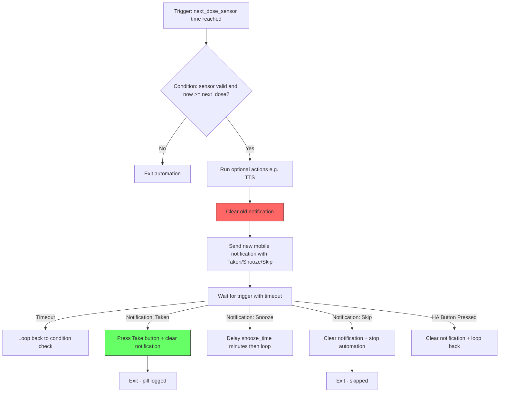

# Blueprint Reminder Automation Fix Plan

## Root Cause Analysis

The automation trace fails at `action/0/repeat/sequence/1` with:

> `TemplateError: Must provide a device or entity ID`

This error occurs at the **clear_notification** step (line 80-85 of [`blueprints/reminder.yaml`](blueprints/reminder.yaml:80)). When Home Assistant resolves a `device_id`-based notify action inside a blueprint, it converts it to a service call template like:

```yaml
action: "notify.mobile_app_{{ device_attr(notify_device, 'name') }}"
```

However, **`notify_device` is never declared in the `variables:` section** of the blueprint. The `!input notify_device` is only used directly in `device_id:` fields, but HA's template engine needs it as a variable to resolve the dynamic service name. Without it, the template renders to an invalid service name, causing the error.

The trace confirms this — the `changed_variables` show `next_dose_sensor`, `btn_entity`, `action_take`, etc., but **`notify_device` is absent**.

---

## All Issues Found

### Issue 1 — CRITICAL: `notify_device` missing from variables

**File**: [`blueprints/reminder.yaml`](blueprints/reminder.yaml:50) (line 50-58)  
**Problem**: The `notify_device` input is used in device actions but not declared in `variables:`. HA converts device actions to service call templates that reference `notify_device`, which is undefined at template rendering time.  
**Fix**: Add `notify_device: !input notify_device` to the `variables:` section.

### Issue 2 — MAJOR: `wait.trigger` conditions lack null safety

**File**: [`blueprints/reminder.yaml`](blueprints/reminder.yaml:124) (lines 124, 130, 135)  
**Problem**: Conditions like `{{ wait.trigger.event.data.action == action_take }}` will throw a Jinja2 error if `wait.trigger` is `None` (i.e., the `wait_for_trigger` timed out). Accessing `.event.data.action` on `None` is undefined.  
**Fix**: Add null guards: `{{ wait.trigger is not none and wait.trigger.platform == 'event' and wait.trigger.event.data.action == action_take }}`

### Issue 3 — MAJOR: No way to detect pill taken via HA UI button

**File**: [`blueprints/reminder.yaml`](blueprints/reminder.yaml:106) (lines 106-120)  
**Problem**: The `wait_for_trigger` only listens for `mobile_app_notification_action` events. If the user presses the Take button directly in the HA UI (not via phone notification), the automation never detects it. The user's trace shows they manually added a `platform: state` trigger for the button, but HA `ButtonEntity` doesn't reliably fire state changes.  
**Fix**: 
1. Fire a custom bus event from [`button.py`](custom_components/pill_logger/button.py:32) when the Take button is pressed
2. Add an event trigger in the blueprint for `pill_logger_pill_taken`

### Issue 4 — MODERATE: `while` loop has no max iteration safeguard

**File**: [`blueprints/reminder.yaml`](blueprints/reminder.yaml:69) (lines 69-72)  
**Problem**: The `while` loop continues as long as the next dose sensor is in the past. If the sensor fails to update after a pill is taken (race condition, error, etc.), the loop runs indefinitely.  
**Fix**: Add a `count` field to the `repeat` block to cap iterations (e.g., max 10 loops = 5 hours of reminders with 30-min snooze).

### Issue 5 — MINOR: `service:` keyword deprecated

**File**: [`blueprints/reminder.yaml`](blueprints/reminder.yaml:126) (line 126)  
**Problem**: Uses `service: button.press` which is the old HA syntax. HA 2024.8+ uses `action:` instead.  
**Fix**: Change `service:` to `action:`.

### Issue 6 — MINOR: No explicit `continue_on_timeout`

**File**: [`blueprints/reminder.yaml`](blueprints/reminder.yaml:106) (lines 106-120)  
**Problem**: The `wait_for_trigger` doesn't specify `continue_on_timeout`. The default is `true`, which is the desired behavior (loop again on timeout), but it should be explicit for clarity.  
**Fix**: Add `continue_on_timeout: true`.

### Issue 7 — MINOR: Sensor state edge case in `while` condition

**File**: [`blueprints/reminder.yaml`](blueprints/reminder.yaml:72) (line 72)  
**Problem**: The condition only checks for `unknown` but not `unavailable` or `None`. If the sensor returns `unavailable`, the `as_datetime` filter would fail.  
**Fix**: Change condition to also guard against `unavailable` and use `has_value` or a more robust template.

---

## Proposed Changes

### 1. Fix [`blueprints/reminder.yaml`](blueprints/reminder.yaml)

```yaml
variables:
  notify_device: !input notify_device          # NEW — fixes the critical error
  next_dose_sensor: !input next_dose_sensor
  btn_entity: !input take_button
  action_take: "TAKE_{{ btn_entity }}"
  action_snooze: "SNOOZE_{{ btn_entity }}"
  action_skip: "SKIP_{{ btn_entity }}"
  tag_id: "reminder_{{ btn_entity }}"
  snooze_delay: !input snooze_time
```

Update the `while` condition to be more robust:
```yaml
while:
  - condition: template
    value_template: >-
      {{ states(next_dose_sensor) not in ['unknown', 'unavailable', 'none', ''] 
         and now() >= states(next_dose_sensor) | as_datetime }}
```

Add `count` to the repeat to prevent infinite loops:
```yaml
repeat:
  count: 10    # Max 10 reminder cycles
  while:
    ...
```

Update `wait_for_trigger` to include the pill_taken event and add `continue_on_timeout`:
```yaml
- wait_for_trigger:
    - platform: event
      event_type: mobile_app_notification_action
      event_data:
        action: "{{ action_take }}"
    - platform: event
      event_type: mobile_app_notification_action
      event_data:
        action: "{{ action_snooze }}"
    - platform: event
      event_type: mobile_app_notification_action
      event_data:
        action: "{{ action_skip }}"
    - platform: event
      event_type: pill_logger_pill_taken
      event_data:
        entity_id: "{{ btn_entity }}"
  timeout:
    minutes: !input snooze_time
  continue_on_timeout: true
```

Update `choose` conditions with null safety:
```yaml
- conditions: "{{ wait.trigger is not none and wait.trigger.platform == 'event' and wait.trigger.event.data.action == action_take }}"
  ...
- conditions: "{{ wait.trigger is not none and wait.trigger.platform == 'event' and wait.trigger.event.data.action == action_snooze }}"
  ...
- conditions: "{{ wait.trigger is not none and wait.trigger.platform == 'event' and wait.trigger.event.data.action == action_skip }}"
  ...
- conditions: "{{ wait.trigger is not none and wait.trigger.platform == 'event' and wait.trigger.event_data.event_type == 'pill_logger_pill_taken' }}"
  sequence:
    - device_id: !input notify_device
      domain: mobile_app
      type: notify
      message: "clear_notification"
      data:
        tag: "{{ tag_id }}"
```

Change `service:` to `action:`:
```yaml
- action: button.press
  target:
    entity_id: !input take_button
```

### 2. Fix [`custom_components/pill_logger/button.py`](custom_components/pill_logger/button.py:32)

Fire a bus event when the Take button is pressed, so automations can listen for it:

```python
async def async_press(self):
    """When pressed, send a signal to update sensors and fire a bus event."""
    async_dispatcher_send(self.hass, f"pill_taken_{self._entry_id}")
    self.hass.bus.async_fire(
        "pill_logger_pill_taken",
        {"entity_id": self.entity_id},
    )
```

---

## Flow Diagram



The red node D is where the critical bug occurs — the clear_notification step fails because `notify_device` is not available as a template variable.

---

## Files to Modify

| File | Change |
|------|--------|
| [`blueprints/reminder.yaml`](blueprints/reminder.yaml) | Add `notify_device` variable, fix null safety in conditions, add pill_taken event trigger, add repeat count, add `continue_on_timeout`, fix `service` → `action`, improve while condition |
| [`custom_components/pill_logger/button.py`](custom_components/pill_logger/button.py) | Add `hass.bus.async_fire` call in `async_press` to emit `pill_logger_pill_taken` event |