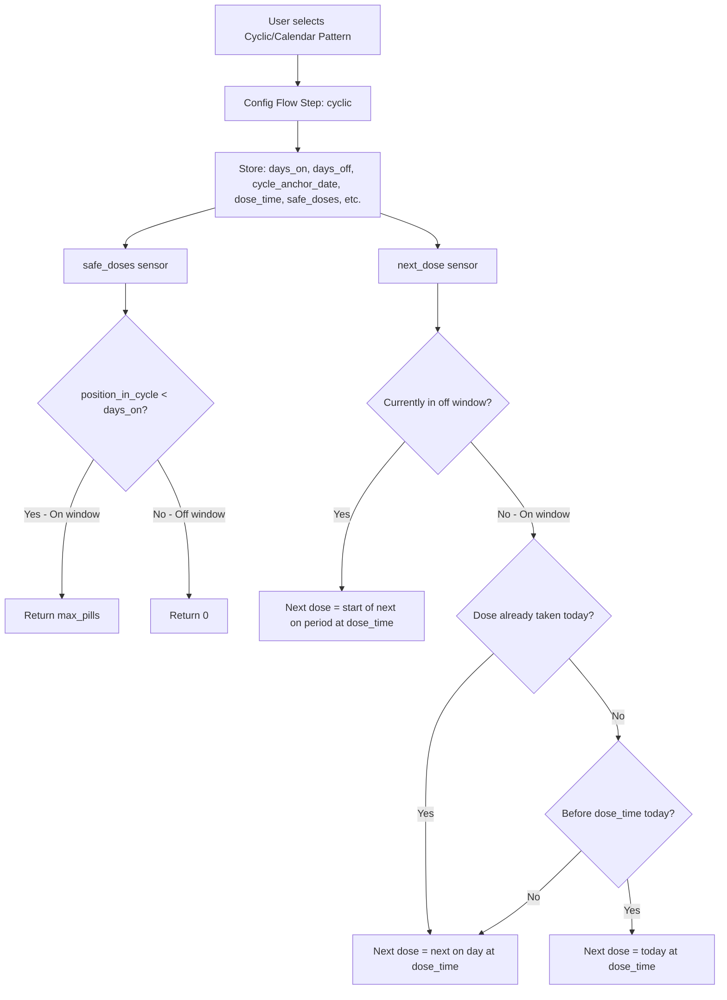

# Plan: Cyclic/Calendar Pattern Tracking Type

## Overview

Add a new medication scheduling type **"Cyclic/Calendar Pattern"** that allows users to define a fixed cycle of X days on, Y days off, repeating continuously from a specific anchor date.

## Architecture

### Data Flow Diagram



### Cycle Calculation

```mermaid
flowchart LR
    subgraph Cycle: 5 on, 2 off
        D0[Day 0: ON] --> D1[Day 1: ON] --> D2[Day 2: ON] --> D3[Day 3: ON] --> D4[Day 4: ON] --> D5[Day 5: OFF] --> D6[Day 6: OFF]
    end
    D6 -->|Repeat| D0
```

**Formula**: `position_in_cycle = (today - anchor_date).days % (days_on + days_off)`
- If `position_in_cycle < days_on` → **ON window**
- If `position_in_cycle >= days_on` → **OFF window**

## Files to Modify

### 1. `custom_components/pill_logger/config_flow.py`

**Changes**:
- Add `"Cyclic/Calendar Pattern"` to the `vol.In` choices in `async_step_user`
- Add routing: `elif user_input["tracking_type"] == "Cyclic/Calendar Pattern": return await self.async_step_cyclic()`
- Add new `async_step_cyclic` method with fields:
  - `initial_stock` (int, default=30)
  - `days_on` (int, required, default=5)
  - `days_off` (int, required, default=2)
  - `cycle_anchor_date` (string, required, default=today as ISO date)
  - `dose_time` (string, required, default="08:00")
  - `safe_doses` (int, required, default=1)
  - `strength`, `half_life`, `hours_to_peak` (optional, same as other types)
  - Effectiveness metric fields (reused via `_effectiveness_schema_fields()`)
- Add `elif tracking_type == "Cyclic/Calendar Pattern":` branch in `PillLoggerOptionsFlowHandler.async_step_init` with cyclic-specific fields: `days_on`, `days_off`, `cycle_anchor_date`, `dose_time`

### 2. `custom_components/pill_logger/sensors/safe_doses.py`

**Changes**:
- Add `elif self._tracking_type == "Cyclic/Calendar Pattern":` branch in `_update_state()`
- Logic:
  1. Read `days_on`, `days_off`, `cycle_anchor_date` from entry options/data
  2. Parse anchor date string to `date` object (fallback: today)
  3. Calculate `position_in_cycle = (now.date() - anchor_date).days % (days_on + days_off)`
  4. If `position_in_cycle < days_on` → `self._attr_native_value = max_pills`
  5. Else → `self._attr_native_value = 0`
- No timestamp filtering needed for cyclic type (the cycle determines availability, not dose history)

### 3. `custom_components/pill_logger/sensors/next_dose.py`

**Changes**:
- Add `elif self._tracking_type == "Cyclic/Calendar Pattern":` branch in `_update_state()`
- Logic:
  1. Read `days_on`, `days_off`, `cycle_anchor_date`, `dose_time` from entry options/data
  2. Parse anchor date and dose time (with fallback defaults)
  3. Calculate current position in cycle
  4. **If in OFF window**: next dose = `(today + days_until_next_on) at dose_time`
     - `days_until_next_on = cycle_length - position_in_cycle`
  5. **If in ON window**:
     - If dose already taken today (check `self._timestamps`) → find next ON day at dose_time
     - If before dose_time today → next dose = today at dose_time
     - If after dose_time today → find next ON day at dose_time
  6. Helper: `_next_on_day_from(days_since_anchor, cycle_length, days_on, offset)` to find the next ON day

### 4. `custom_components/pill_logger/translations/en.json`

**Changes**:
- Add `"Cyclic/Calendar Pattern"` to the `tracking_type` options (in user step)
- Add new `cyclic` step section with labels for all cyclic-specific fields
- Add cyclic-specific field labels to the `options.step.init.data` section

### 5. `memory-bank/activeContext.md` and `memory-bank/progress.md`

**Changes**: Document the new feature, files modified, and design decisions.

## Design Decisions

| Decision | Rationale |
|----------|-----------|
| `dose_time` field (HH:MM) on cyclic step | Gives users control over when during ON days the dose is scheduled; consistent with Time of Day pattern |
| `cycle_anchor_date` as ISO date string | Simple, consistent with HA string-based config; parsed with `date.fromisoformat()` |
| Default anchor = today at config time | Computed dynamically in `async_step_cyclic` so the schema default is always current |
| Safe doses returns `max_pills` on ON days, `0` on OFF days | Clean binary behavior; the cycle itself is the constraint, not dose history |
| No timestamp filtering for cyclic safe_doses | Cycle position is the sole determinant; timestamps still tracked for next_dose and other sensors |
| String literal tracking type name | Consistent with existing codebase pattern (no const for tracking types) |

## Edge Cases Handled

- **`days_on = 0`**: Would mean never active; config flow should validate `days_on >= 1`
- **`days_off = 0`**: Valid — means always active (every day is an ON day)
- **Future anchor date**: Python modulo handles negative `days_since_anchor` correctly; all days before anchor are OFF days
- **Invalid anchor date string**: Fallback to today's date
- **Invalid dose_time string**: Fallback to 08:00

## Verification

- Run `python3 -m py_compile` on each modified `.py` file
- Verify no cyclic import issues (all changes are additive; no new cross-module imports)
- Verify existing tracking types are undisturbed (all changes are additive `elif` branches)