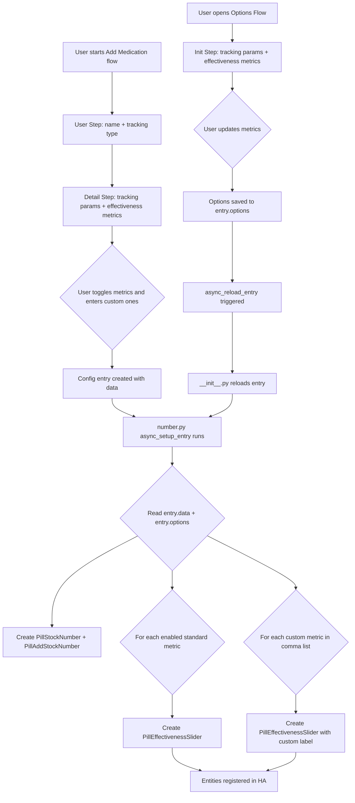

# Effectiveness Mapping Feature — Implementation Plan

## Overview

Add an "Effectiveness Mapping" feature that lets users configure subjective metric sliders (1–10 scale) for each medication entry. These sliders allow tracking how well a medication is working across dimensions like pain, mood, nausea, and fatigue — plus any custom metrics the user defines.

## Architecture

### Data Flow



### Data Structure

Effectiveness metrics are stored in both `entry.data` from initial setup and `entry.options` from options flow. The `number.py` reads from `entry.options` with fallback to `entry.data`:

```python
{
    # ... existing fields like hours_between_doses, safe_doses, etc. ...
    "metric_pain": True,          # bool - standard metric toggles
    "metric_mood": False,
    "metric_nausea": True,
    "metric_fatigue": False,
    "custom_metrics": "brain fog,joint stiffness"  # comma-separated string
}
```

### Entity Design

Each effectiveness slider is a `RestoreNumber` entity:

| Attribute | Value |
|---|---|
| Base class | `RestoreNumber` |
| `should_poll` | `False` |
| Range | 1–10, step 1 |
| Mode | `NumberMode.SLIDER` |
| Icon | Per-metric e.g. `mdi:emoticon-cry` for pain |
| Unique ID | `{entry_id}_eff_{metric_key}` or `{entry_id}_eff_custom_{sanitized}` |
| Name | `{MedName} {Metric Title} Effectiveness` |
| Persistence | Via `RestoreNumber.async_get_last_number_data()` |

## Files to Modify

### 1. `custom_components/pill_logger/const.py`

Add constants:

```python
STANDARD_EFFECTIVENESS_METRICS = {
    "pain": "Pain",
    "mood": "Mood",
    "nausea": "Nausea",
    "fatigue": "Fatigue",
}

EFFECTIVENESS_METRIC_ICONS = {
    "pain": "mdi:emoticon-cry",
    "mood": "mdi:emoticon-happy",
    "nausea": "mdi:emoticon-sick",
    "fatigue": "mdi:sleep",
}

DEFAULT_METRIC_ICON = "mdi:chart-line"
```

Add a `sanitize_key()` helper function that lowercases, strips, and replaces non-alphanumeric characters with underscores for use in unique IDs.

### 2. `custom_components/pill_logger/config_flow.py`

**Both initial setup AND options flow** — effectiveness metrics appear in all configuration steps.

In all three initial setup steps (`async_step_regular_interval`, `async_step_time_of_day`, `async_step_as_needed`), add after the existing schema fields:

- `vol.Optional("metric_pain", default=False)` — `bool`
- `vol.Optional("metric_mood", default=False)` — `bool`
- `vol.Optional("metric_nausea", default=False)` — `bool`
- `vol.Optional("metric_fatigue", default=False)` — `bool`
- `vol.Optional("custom_metrics", default="")` — `str`

These will be stored in `entry.data` via `self._data.update(user_input)`.

In `PillLoggerOptionsFlowHandler.async_step_init()`, add the same fields with defaults sourced from `options.get(key, data.get(key, default))`:

- `vol.Optional("metric_pain", default=options.get("metric_pain", data.get("metric_pain", False)))` — `bool`
- `vol.Optional("metric_mood", default=options.get("metric_mood", data.get("metric_mood", False)))` — `bool`
- `vol.Optional("metric_nausea", default=options.get("metric_nausea", data.get("metric_nausea", False)))` — `bool`
- `vol.Optional("metric_fatigue", default=options.get("metric_fatigue", data.get("metric_fatigue", False)))` — `bool`
- `vol.Optional("custom_metrics", default=options.get("custom_metrics", data.get("custom_metrics", "")))` — `str`

These will be stored in `entry.options` via `self.async_create_entry(title="", data=user_input)`.

### 3. `custom_components/pill_logger/number.py`

Add a new `PillEffectivenessSlider` class:

```python
class PillEffectivenessSlider(RestoreNumber):
    should_poll = False

    def __init__(self, med_name, entry_id, metric_key, metric_label, icon):
        self._med_name = med_name
        self._metric_key = metric_key
        self._attr_name = f"{med_name} {metric_label} Effectiveness"
        self._attr_unique_id = f"{entry_id}_eff_{metric_key}"
        self._attr_icon = icon
        self._entry_id = entry_id
        self._attr_native_value = 1.0
        self._attr_native_step = 1.0
        self._attr_native_min_value = 1.0
        self._attr_native_max_value = 10.0
        self._attr_mode = NumberMode.SLIDER

    # device_info property - same pattern as existing entities

    async def async_added_to_hass(self):
        await super().async_added_to_hass()
        last_state = await self.async_get_last_number_data()
        if last_state and last_state.native_value is not None:
            self._attr_native_value = last_state.native_value

    async def async_set_native_value(self, value: float):
        self._attr_native_value = value
        self.async_write_ha_state()
```

Update `async_setup_entry()` to dynamically create slider entities:

```python
async def async_setup_entry(hass, entry, async_add_entities):
    med_name = entry.data["medication_name"]
    initial_stock = entry.data["initial_stock"]
    entities = [
        PillStockNumber(med_name, entry.entry_id, initial_stock),
        PillAddStockNumber(med_name, entry.entry_id),
    ]

    # Read effectiveness metrics from options, falling back to entry data
    options = entry.options
    data = entry.data

    for key, label in STANDARD_EFFECTIVENESS_METRICS.items():
        if options.get(f"metric_{key}", data.get(f"metric_{key}", False)):
            icon = EFFECTIVENESS_METRIC_ICONS.get(key, DEFAULT_METRIC_ICON)
            entities.append(PillEffectivenessSlider(med_name, entry.entry_id, key, label, icon))

    custom_str = options.get("custom_metrics", data.get("custom_metrics", ""))
    if custom_str:
        for raw in custom_str.split(","):
            name = raw.strip()
            if name:
                skey = sanitize_key(name)
                entities.append(PillEffectivenessSlider(
                    med_name, entry.entry_id, f"custom_{skey}", name, DEFAULT_METRIC_ICON
                ))

    async_add_entities(entities)
```

### 4. `custom_components/pill_logger/translations/en.json`

Add labels for the new fields in **all four step sections** (three initial setup steps + options):

- `metric_pain`: "Track Pain effectiveness"
- `metric_mood`: "Track Mood effectiveness"
- `metric_nausea`: "Track Nausea effectiveness"
- `metric_fatigue`: "Track Fatigue effectiveness"
- `custom_metrics`: "Custom metrics (comma-separated, e.g. brain fog, joint stiffness)"

### 5. No changes needed to `__init__.py`

The existing reload mechanism (`entry.async_on_unload(entry.add_update_listener(async_reload_entry))`) already triggers platform re-setup when options change. The `number` platform is already in `PLATFORMS`. No changes required.

### 6. No changes needed to existing sensors

The sensor platform is independent. Existing concentration, steady state, etc. sensors continue working as before.

## Key Design Decisions

| Decision | Rationale |
|---|---|
| Effectiveness config in both initial setup AND options flow | Users can configure metrics right from first setup; also editable later via Options |
| Individual boolean fields for standard metrics | HA renders booleans as toggle switches — clean UX |
| Comma-separated string for custom metrics | Simple, flexible, easy to parse; avoids complex list schemas |
| `RestoreNumber` base class | Persists slider value across restarts; already used in codebase |
| `NumberMode.SLIDER` | Better UX for subjective 1–10 scale than BOX |
| Unique ID format with `_eff_` namespace | Prevents collisions with existing stock/add_stock entities |
| `sanitize_key()` for custom metric IDs | Ensures valid, unique entity IDs from arbitrary user input |
| No changes to `__init__.py` | Existing reload mechanism handles dynamic entity creation/removal |
| `entry.options` with fallback to `entry.data` in `number.py` | Initial setup stores in `entry.data`; options updates store in `entry.options`; number.py reads both with correct priority |

## Verification Steps

1. `python3 -m py_compile` on every modified file
2. Confirm existing sensors are untouched
3. Confirm options flow renders correctly with new fields
4. Confirm slider entities appear/disappear based on options
5. Confirm slider values persist across HA restarts
6. Update memory-bank files